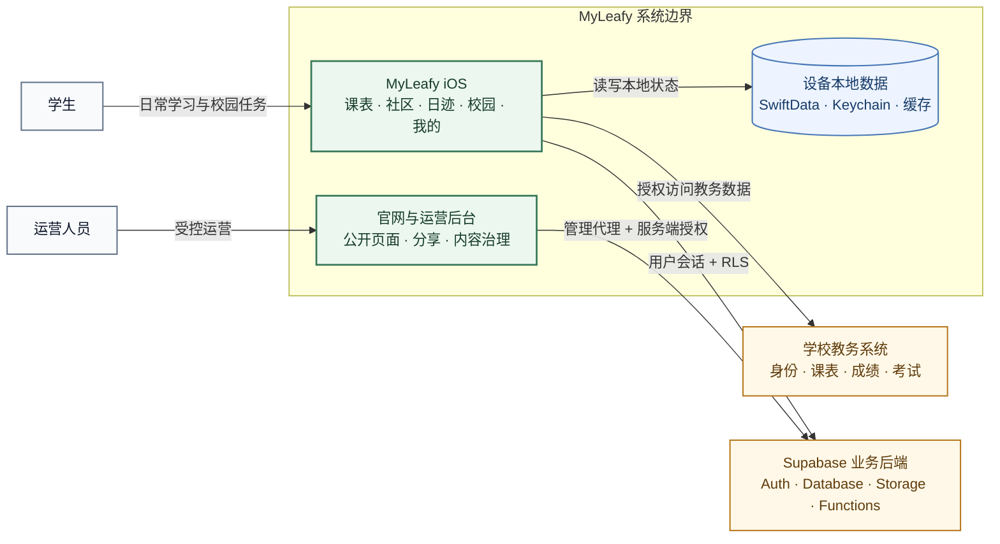

# MyLeafy

<p align="center">
  面向高校学习与校园生活的原生 iOS 应用，目前主要服务北京林业大学。
</p>

<p align="center">
  
  
  
  
  
</p>

<p align="center">
  <a href="https://apps.apple.com/cn/app/myleafy-%E6%9E%97%E9%97%B4%E6%A0%A1%E5%9B%AD/id6763968535">
    
  </a>
  <a href="https://github.com/IsaacHuo/MyLeafy/releases">
    
  </a>
</p>

MyLeafy 以课表和学业数据为核心，将教务查询、学习管理、校园社区与共享课表整合在一个原生 iOS 客户端中。根导航为课表、社区、日迹、校园、我的；日迹顶部直接提供随记、日程、推送，侧栏“记录”分组提供“记录日迹”和“每日回顾”。随记与个人日程按校园身份保存在本地。北京林业大学入口直接连接学校教务系统获取用户授权的数据；通用入口只提供本机导入能力。Supabase 承载社区、通知、评分、共享与运营数据。

> 仓库名、Xcode target 与部分内部类型仍使用 `leafy` / `Leafy`。对外产品名称统一为 **MyLeafy**。



## 项目能力

| 领域 | 当前能力 |
|---|---|
| 课表 | 按学年浏览（秋季开学至下一学年开始前一天）、20 周单学期数据、课程详情、个人日程投影、提醒、分享图、小组件与共享课表 |
| 校园 | 成绩、考试、教学计划、培养方案、校历、自习安排（空闲教室等内部工具、图书馆座位预约、校园热力图）、学习空间、体育与职业相关工具 |
| 社区 | 帖子、图片、评论、点赞、投票、通知、公告、个人内容与内容分享 |
| 日迹 | 随记、个人日程与推送；“记录”分组提供“记录日迹”和“每日回顾”；记录日迹按自然年查看月度随记数/记录天数、近 30 天热力、连续记录、星期/时段习惯、常用标签和里程碑，可点日期查看当天随记；统计图本机生成并通过系统分享，只含聚合统计，不上传；输入器支持聚焦展开，并在达到四个视觉行时提供放大/缩小编辑；加号菜单不再新建文章，历史文章仍可查看编辑；随记和日程按校园身份保存在本地 |
| 评价 | 教师、课程等结构化评分；详情页星级居中，数据能力按校园配置开放 |
| 个性化 | 浅色/深色外观、主题色、显示密度、多语言，以及照片和纯色课表背景 |
| 运营 | 独立 Web 管理后台、角色权限、内容管理、配置管理、审计与受控导出 |

功能是否显示由校园能力配置、用户身份与后端配置共同决定。各校园环境仅开放符合当前配置的入口。

## 设计与架构

MyLeafy 采用原生 iOS 优先、边界清晰和本地可用的工程策略：

- SwiftUI 构建页面与导航，iOS 17 为部署基线；根导航使用系统 `TabView`，不叠加页面透明度伪造淡入；在 iOS 26 上使用受可用性检查保护的系统视觉能力。
- 教务数据通过 `URLSession`、显式 Cookie 管理和 SwiftSoup 解析；课表链路在必要时使用 `WKWebView` 复现浏览器路径。
- SwiftData 保存课表、成绩、按校园身份隔离的随记与个人日程等用户侧本地数据；页面通过预计算投影与展示数据降低复杂网格的渲染成本。
- Supabase Auth、PostgreSQL、Storage 与 Edge Functions 承载非教务业务；RLS、校园范围和资源所有权共同约束数据访问。
- Web 运营后台通过 Cloudflare Pages Functions 代理管理请求，管理会话不暴露给浏览器 JavaScript。

详细边界、数据流和依赖方向见[当前架构](state/ARCHITECTURE.md)。

## 技术栈

| 范围 | 技术 |
|---|---|
| iOS UI | SwiftUI |
| 本地持久化 | SwiftData |
| 教务网络 | URLSession、HTTPCookieStorage、WKWebView |
| HTML 解析 | SwiftSoup |
| 系统服务 | WeatherKit、WidgetKit、Keychain |
| 业务后端 | Supabase Auth、PostgreSQL、Storage、Edge Functions |
| Web 后台 | React 18、React-admin 5、MUI、ECharts、Vite、TypeScript |
| 边缘代理 | Cloudflare Pages Functions |
| 自动化检查 | GitHub Actions、Vitest、Playwright、XCTest |

## 仓库结构

```text
leafy/
├── leafy/                  # iOS 主应用
│   ├── App/                # 应用启动、根导航、主题与生命周期
│   ├── Core/               # 依赖、持久化、校园能力、并发等基础设施
│   ├── Features/           # Auth、Timetable、Community、Schedule、Discover、Profile
│   ├── Services/           # 教务、Supabase、同步与诊断服务
│   ├── Parsers/            # 教务 HTML 解析
│   └── Shared/             # 跨功能模型与共享组件
├── leafyTests/             # iOS 单元与契约测试
├── leafyWidget/            # Widget 扩展
├── LeafyShareExtension/    # 系统分享扩展
├── supabase/               # migrations、Edge Functions、模板与测试
├── site/                   # 官网、运营后台与 Cloudflare Functions
├── Config/                 # 可提交的配置模板；本地密钥文件不入库
├── docs/                   # 产品、设计、工程与运维文档（设计与规划）
├── state/                  # 当前真实状态：进度与架构（CURRENT / ARCHITECTURE）
└── logs/                   # 可复用的排查与根因知识
```

## 本地运行

### 环境要求

- macOS 与 Xcode 26 或更新版本（项目引用 iOS 26 SDK API，并为 iOS 17–25 提供运行时回退）
- iOS 17.0 或更新版本的模拟器/设备
- Node.js 20.19 或更新版本，或 Node.js 22.12 及更新版本（仅网站与运营后台）
- 可用的目标学校教务账号（验证真实教务链路时需要）
- 自建 Supabase 项目（验证社区、共享与运营能力时需要）

### iOS App

```bash
git clone https://github.com/IsaacHuo/MyLeafy.git
cd leafy

cp Config/Leafy.example.xcconfig Config/Leafy.local.xcconfig
open leafy.xcodeproj
```

在 `Config/Leafy.local.xcconfig` 中配置本地 Supabase URL 与 publishable key，然后选择 `leafy` scheme 运行。真实密钥、本地 xcconfig、证书和描述文件不得提交到仓库。

若只关注不依赖 Supabase 的本地页面，可保留示例配置；社区、共享课表和部分远程能力会进入不可用状态。

### 网站与运营后台

```bash
cd site
npm ci
npm run dev
```

`npm run dev` 适合开发公开网站或使用 mock API 调试后台界面。包含 Cloudflare Pages Functions 的真实代理链路使用：

```bash
npm run dev:pages
```

环境变量与安全边界见[运营后台](docs/engineering/admin-console.md)。

### Supabase

仓库中的 `supabase/` 包含数据库迁移、Edge Functions、邮件模板、导入模板与验证脚本。新环境应从空项目按迁移顺序建立 schema，并按需部署函数：

```bash
supabase link --project-ref <project-ref>
supabase db push
supabase functions deploy community-bootstrap-user
```

不要在 iOS、网站前端或公开配置中使用 `service_role`。完整说明见[Supabase 接入](docs/engineering/supabase.md)。

## 文档

| 文档 | 适用读者 | 内容 |
|---|---|---|
| [项目总览](docs/product/overview.md) | 所有人 | 产品定位、能力范围、数据边界与限制 |
| [当前架构](state/ARCHITECTURE.md) | iOS/后端开发者 | 当前分层、依赖、教务链路、本地存储与系统边界 |
| [App 产品设计](docs/design/app-design.md) | 产品与客户端开发者 | 信息架构、核心流程、页面状态与产品原则 |
| [UI 风格规范](docs/design/ui-style-guide.md) | 设计与客户端开发者 | 设计令牌、组件、可访问性与页面模式 |
| [Supabase 接入](docs/engineering/supabase.md) | 后端与客户端开发者 | 身份、数据域、RLS、Storage、Functions 与本地联调 |
| [运营后台](docs/engineering/admin-console.md) | Web/后端开发者 | 管理架构、角色、安全、资源与开发验证 |
| [贡献规范](CONTRIBUTING.md) | 贡献者 | Issue、分支、PR、测试与安全要求 |

文档索引见 [`docs/README.md`](docs/README.md)。当前开发状态见 [`state/CURRENT.md`](state/CURRENT.md)，可复用排查知识见 [`logs/`](logs/)。

## 已知边界

- 教务系统不是稳定 API。页面结构、登录流程或网络策略变化可能使解析暂时失效。
- 当前教务身份绑定由 App 在登录成功后发起；它不等同于服务端对学校身份进行独立证明。
- 社区、评价和共享能力依赖正确部署的 Supabase schema、RLS 与 Edge Functions。
- 教师与课程等目录型数据需要经过可信来源整理或后台审核，仓库不会自动保证数据完整性。
- 这是持续演进中的校园产品，内部数据模型与未稳定接口可能变化。

## 发展方向

项目近期优先提高教务解析稳定性、完善错误与恢复流程、收紧后端安全边界，并支持不同校园通过能力配置复用基础架构。未来功能以实际使用反馈为依据，不承诺固定时间表。

## 参与贡献

提交代码前请阅读[贡献规范](CONTRIBUTING.md)。涉及新功能或行为变化的 PR 应同时更新对应文档；涉及用户数据、认证、校园身份或管理权限的改动必须说明安全边界与验证方式。

## 许可

除另有说明外，本仓库中的原创源代码和项目文档使用 [Apache License 2.0](LICENSE) 许可。MyLeafy 名称、商标、Logo、校园照片、产品截图、第三方内容和用户数据不因该许可证获得额外授权；第三方材料继续遵循各自的许可与权利声明。

## 联系

- 问题与建议：[GitHub Issues](https://github.com/IsaacHuo/MyLeafy/issues)
- 邮箱：`support@myleafy.space`
