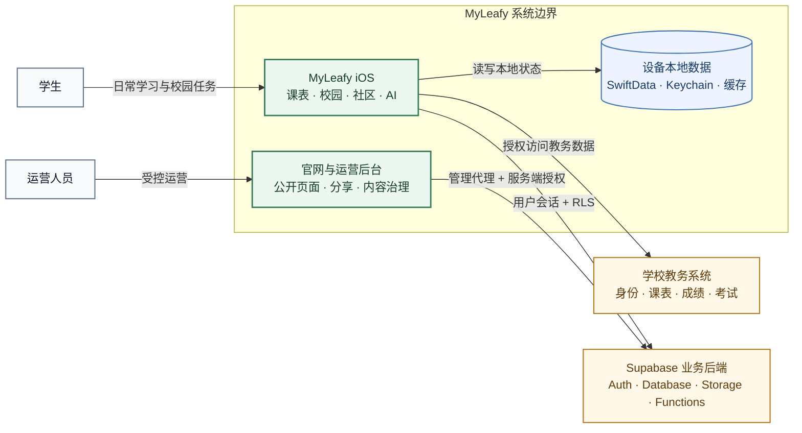
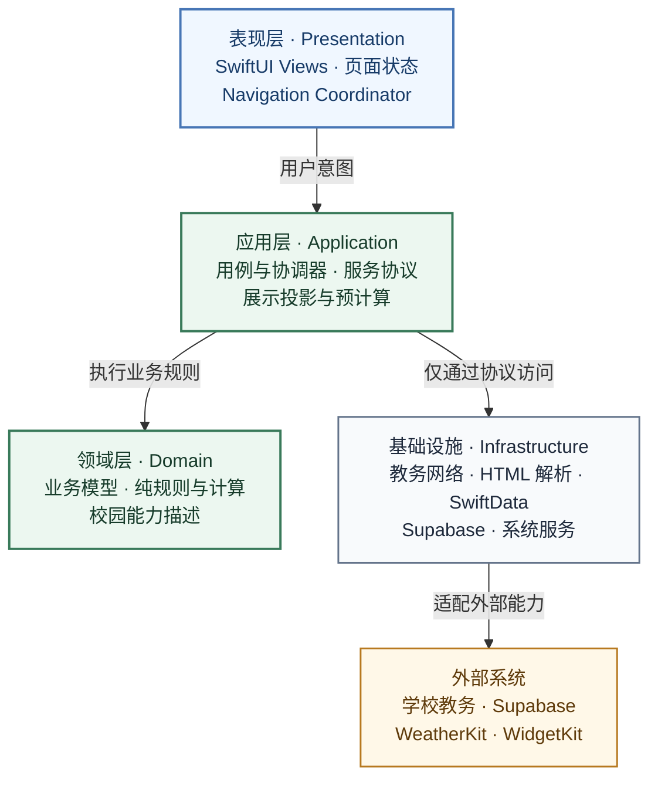
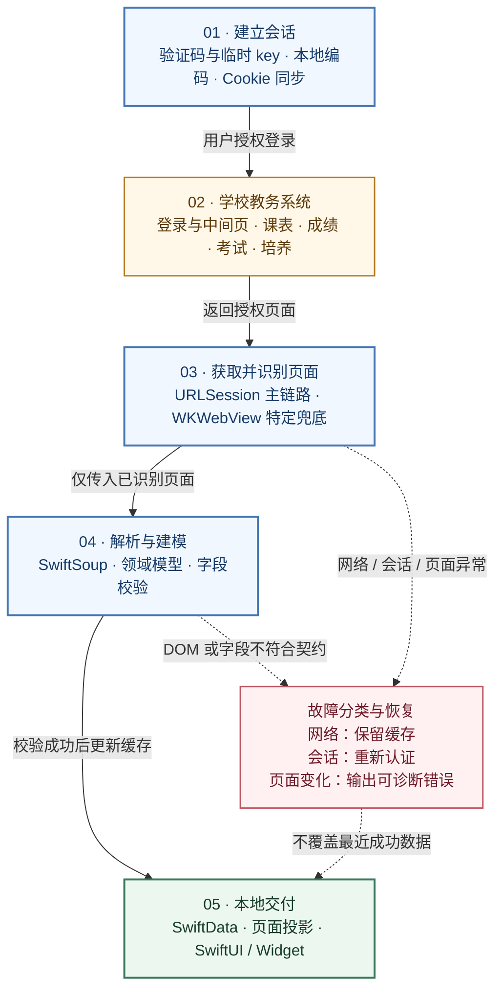

# MyLeafy 架构说明

本文描述 MyLeafy 当前代码库的系统边界、iOS 分层、关键数据链路和安全约束。它面向需要理解或修改项目的开发者，不作为逐文件 API 文档。

产品范围见[项目总览](overview.md)，页面规则见[App 产品设计](app-design.md)，后端与管理端分别见 [Supabase 接入](supabase.md)和[运营后台](admin-console.md)。

## 1. 架构目标

MyLeafy 同时面对三类性质不同的系统：不稳定的学校网页、强调本地体验的 iOS 客户端，以及需要严格授权的云端社区和运营业务。因此架构重点是隔离变化，而不是追求形式上的层数。

- 将学校 HTML、Cookie 和页面跳转限制在教务基础设施层。
- 让页面依赖业务协议和投影模型，而不是直接拼装网络请求。
- 明确本地数据、学校数据与 Supabase 数据的权威来源。
- 允许校园能力按配置裁剪，不在页面中散落学校判断。
- 让高权限运营能力停留在服务端边界内。
- 对复杂课表和大型校园页面使用预计算、缓存和窄状态更新。

## 2. 系统上下文



系统由四个主要运行单元组成：

| 运行单元 | 部署位置 | 职责 |
|---|---|---|
| MyLeafy iOS App | 用户设备 | 学校登录、教务数据获取、本地持久化、用户交互与普通 Supabase 业务 |
| 学校教务系统 | 学校基础设施 | 学校身份、课表、成绩、考试、教学计划和其他教务数据 |
| Supabase | 托管云服务 | Auth、PostgreSQL、RLS、Storage、Realtime 和 Edge Functions |
| 官网与运营后台 | Cloudflare Pages | 公开页面、分享落地页、管理界面和管理 API 代理 |

## 3. iOS 分层与依赖方向



### 3.1 App 与 Core

`leafy/App/` 负责应用级组装：

- `leafyApp` 创建模型容器、环境值和生命周期处理。
- `ContentView` 组织根 Tab，并根据系统版本选择兼容实现。
- `AppNavigationCoordinator` 处理根 Tab、校园详情、共享课表、Widget 和分享链接等跨功能导航。
- `App/Theme/` 提供颜色、字体、间距、圆角、页面背景和兼容视觉组件。

`leafy/Core/` 保存不属于单一功能的基础能力：

- `Dependencies`：通过 `LeafyDependencies` 注入仓储、天气、图片处理和 Widget 发布能力。
- `Persistence`：创建和恢复 SwiftData `ModelContainer`。
- `Campus`：校园标识、能力描述和数据作用域。
- `Concurrency`、`ImageProcessing`、`Widget`：跨功能基础设施。

应用层只负责组合，不应承载教务页面解析或复杂业务计算。

### 3.2 Features

`leafy/Features/` 按用户能力组织：

```text
Features/
├── Auth/
├── LeafyAI/
│   ├── Domain/
│   ├── Application/
│   ├── Data/
│   │   ├── API/
│   │   ├── Persistence/
│   │   └── LocalContext/
│   └── Presentation/
├── Timetable/
│   ├── Domain/
│   ├── Application/
│   └── Presentation/
│       ├── Screen/
│       ├── Grid/
│       ├── Agenda/
│       ├── Processing/
│       ├── Sheets/
│       └── Share/
├── Community/
│   ├── Domain/
│   ├── Application/
│   ├── Data/Supabase/
│   └── Presentation/
├── Discover/
│   ├── Presentation/
│   ├── Application/
│   ├── Domain/
│   └── Data/
└── Profile/
    ├── Presentation/
    ├── Application/
    └── Domain/
```

目录职责如下：

- `Presentation`：SwiftUI View、页面状态、轻量 ViewModel 和导航适配。
- `Application`：面向用户操作的用例、协调器、服务协议和数据组合。
- `Domain`：不依赖 UI 的模型、规则、投影、索引和纯计算。
- `Data`：某些领域的 live service 实现或数据适配。

依赖方向保持为 `Presentation → Application → Domain`。`Data` 实现应用层定义的窄协议，组合根负责将实现注入页面；Domain 不依赖 SwiftUI、Supabase 或具体持久化。Leafy AI、社区和课表的旧类型名与公开方法签名保留，目录迁移不代表业务或存储 schema 变化。

历史代码仍有部分跨层文件。新增代码应优先遵守依赖方向，而不是机械搬迁所有旧文件。

### 3.3 Services 与 Parsers

`leafy/Services/` 是外部系统边界：

- `SchoolNetworkManager*`：强智登录、Cookie、教务请求、页面识别和会话失效。
- `SchoolDataSyncService` / `SchoolDataPrefetchCoordinator`：教务数据同步和预取协调。
- `TimetableWebViewBootstrapper`：课表 HTTP 路径失败后的浏览器行为兜底。
- `Services/Supabase/`：Supabase 配置、共享课表和其他跨功能业务服务；社区专属实现位于 `Features/Community/Data/Supabase/`。
- `Diagnostics/`：开发诊断与受控日志。

`leafy/Parsers/` 使用 SwiftSoup 将学校 HTML 转换为业务模型。解析器不负责页面导航、持久化或用户提示。

## 4. 启动与运行时组装

应用启动的关键步骤为：

1. 迁移外观和主题偏好。
2. 创建 SwiftData 模型容器；若持久化 store 损坏，备份后尝试重建，必要时降级为内存 store。
3. 恢复校园上下文和学校身份缓存。
4. 无有效学校身份时展示 `LoginView`，否则进入 `ContentView`。
5. 根据校园能力决定社区和校园入口的可见性。
6. 在需要社区能力时恢复匿名 Supabase 会话和 profile，而不是阻塞 App 首屏。
7. 进入前台或用户主动刷新时更新学期配置、通知计数和必要数据。

根 Tab 的逻辑顺序为 `Leafy / 课表 / 社区 / 校园 / 我的`，默认选中课表。社区不可用时会从可见入口中移除，而非显示必然失败的空壳页面。

## 5. 教务访问链路



### 5.1 登录与会话

`SchoolNetworkManager` 是学校网络访问的主入口，并通过扩展按职责拆分：

- `SchoolNetworkManager.swift`：共享状态、`URLSession` 与基础地址。
- `+Core.swift`：请求预处理、Cookie 同步、编码识别、登录页检测和会话清理。
- `+Auth.swift`：临时 key、验证码、强智 encode 和登录结果识别。
- `+Timetable.swift`：课表、成绩和相关入口回退。
- `+Discover.swift`：考试、教学培养、教室等学业请求。

项目不依赖 `URLSession` 隐式 Cookie 行为。登录成功后会收集响应 Cookie；请求前同步到 `HTTPCookieStorage`，必要时显式构造 `Cookie` 请求头。识别到登录页或会话过期后，统一使学校身份失效。

学校密码只用于用户发起的学校登录，不应写入 Supabase、日志或公开错误信息。

### 5.2 登录流程

强智登录目前包括：

1. 获取登录临时 key。
2. 请求验证码图片。
3. 在客户端执行教务所需的 encode。
4. 提交学号、编码结果与验证码。
5. 综合响应 HTML、跳转位置、Cookie 和页面特征判断成功或失败。

不能只用 HTTP 状态码判断教务登录；学校可能以 `200 OK` 返回登录页或错误页。

### 5.3 课表回退策略

课表是教务链路中最复杂的页面。当前策略从低成本到高成本依次尝试：

1. 使用已知登录落点或直接课表地址。
2. 识别查询表单并补齐学期参数。
3. 从 DOM、脚本、`href` 与 `onclick` 提取候选入口。
4. 用课表页面特征判断结果是否可解析。
5. 纯 HTTP 路径失败时，把现有 Cookie 注入隐藏 `WKWebView`，复现浏览器跳转。

`WKWebView` 只用于课表兜底，不是通用网页自动化层。若学校页面发生变化，应优先修复请求识别和解析器，而不是扩大 WebView 依赖。

### 5.4 解析与错误分类

解析器将 HTML 转换为 `Course`、`Grade`、考试、教学计划、培养方案和教室等模型。调用方需要区分至少四类失败：

- 网络不可达或超时。
- 学校会话失效。
- 返回了非预期页面或中间页。
- 页面到达但 DOM 结构无法解析。

用户界面只显示可行动的摘要；开发诊断可以保留脱敏请求信息和缓存目录中的 HTML 样本。Release 行为不得暴露 Cookie、密码、验证码、完整学号或未经审查的原始页面。

## 6. 本地持久化与投影

### 6.1 SwiftData

SwiftData 保存需要离线读取或跨启动保留的本地模型，包括课程、成绩、课程备注、提醒设置、收藏教室和学习记录等。模型容器由 `AppModelContainerFactory` 集中创建，避免页面各自配置 store。

权威关系必须明确：

- 学校课表和成绩的权威来源仍是学校系统；SwiftData 是本地副本。
- 用户创建的备注和提醒以本地数据为权威。
- 社区帖子和通知以 Supabase 为权威，不复制为完整 SwiftData 数据库。

### 6.2 课表性能

课表视图同时处理周次、节次、重叠课程、提醒、考试、倒计时和交互状态。为避免 SwiftUI `body` 重复过滤和排序，项目使用：

- `TimetableGridSnapshot` 等预计算布局输入。
- 一次构造并贯穿缓存的 `TimetableRenderInput`，避免同一刷新周期重复生成输入签名。
- 按 `(week, day)` 和 `(week, day, period)` 建立的提醒索引。
- 周课表和紧凑视图共享的 projection。
- 稳定课程颜色索引和缓存的展示模型。
- Widget 专用共享数据，不让扩展直接访问主 App SwiftData 上下文。

性能优化应优先减少重复计算和无关状态传播，不应通过删除错误、空状态或可访问性信息换取表面流畅。

### 6.3 社区与 Leafy AI 投影

- 社区评价页只创建当前栏目的视图树并按需执行首次加载；栏目级 store 保留搜索、筛选和分页生命周期。
- 社区 Feed 的时间格式化器集中复用，瀑布流左右列只在输入数组变化时重建。
- Leafy AI 使用 `CampusAIConversationProjection` 一次完成会话筛选和消息—动作索引，消息行按消息 ID 读取动作。
- 流式文本保存在 `CampusAIChatSession` 的瞬时状态中，SwiftData 仅按检查点、完成、取消或失败边界持久化。

性能测量使用相同设备、构建配置、数据和交互，各采集三次并比较中位数。`LeafyPerformanceSignposter` 只记录课表快照、AI projection、评分加载和社区 Feed projection 的区间，不记录用户文本或个人数据。只有中位数改善至少 10%、峰值内存回退不超过 5% 且无新增 app-owned 泄漏时，才对外宣称提速。

## 7. 校园能力与配置

`ActiveCampusContext`、校园描述和 capability 决定功能可见性与服务实现。北京林业大学适配器可以访问强智教务、社区和学校特定工具；自定义校园只开放可由导入数据或通用本地能力支撑的功能。

需要遵守：

- 页面通过能力查询决定是否展示入口。
- 服务端数据始终带校园作用域，不能只依赖客户端过滤。
- 学期配置优先使用远程 active 配置，失败时回退最近成功缓存，再回退 App 内置默认值。
- 校园特定常量应集中在描述或适配层，避免散落在 View 中。

## 8. Supabase 业务边界

Supabase 不接管学校登录。常规链路是：

1. App 已建立学校身份。
2. 创建或恢复匿名 Supabase Auth 会话。
3. 调用 `community-bootstrap-user`。
4. Edge Function 按当前 `auth.uid()`、校园和教务标识建立 profile 映射。
5. App 通过窄仓储协议访问社区、通知、评价和共享能力。

主要客户端边界：

- `LeafySupabase` / `SupabaseConfig`：配置与 client 创建。
- `Features/Community/Application/CommunitySessionManager`：会话和 profile 生命周期。
- `Features/Community/Data/Supabase/CommunityService`：社区数据操作。
- `TimetableSharingService`：共享课表数据、邀请码和共享关系。
- `Live*Repository`：面向功能的仓储实现或兼容 facade。

安全不能依赖客户端代码。表访问由 RLS、校园作用域和所有权约束；需要跨用户或高权限的操作由 Edge Functions 完成。

## 9. 共享课表

共享课表是“用户主动发布的只读课表数据”，不是云端主课表：

1. 本地教务课表仍为个人展示的权威来源。
2. 用户第一次手动发布后，Supabase 保存受限字段的课表数据。
3. 已发布用户后续成功刷新课表时，可以更新对应学期数据。
4. 邀请码明文仅短暂展示，数据库保存 hash。
5. 邀请码限时且单次接受；关系为单向只读。
6. 分享者可撤销，查看者可移除关系。

不得上传成绩、备注、提醒或其他不属于共享课表最小字段集的数据。

## 10. Leafy AI 边界

AI 功能由对话 UI、上下文构建、模型访问、Artifact 生成和动作路由组成。

- 自备 API Key 保存在 Keychain。
- 本机学业上下文应按请求最小化组装。
- 对话与 Artifact 元数据主要保存在本机。
- 默认 Leafy AI 服务由 `campus-ai-assistant` 固定调用 Flash；免费额度按 Supabase Auth 用户计数，不依赖 App Transaction，订阅额度只接受服务端验证成功的 StoreKit 2 交易 JWS。两者统一通过服务端额度 RPC 控制次数，完整链路见[Leafy AI 免费额度鉴权](leafy-ai-quota-authentication.md)。
- 自备 DeepSeek API Key 保存在 Keychain 并由设备直连 DeepSeek；Pro 仅在这一模式开放。
- AI 可以建议或准备动作，但不直接修改学校数据、代替用户发布社区内容或绕过页面确认。
- 完整 Markdown、公式和复杂 Artifact 在独立阅读页渲染，聊天列表保持轻量。

## 11. 运营后台链路

管理后台与 iOS 共享 Supabase 项目，但不共享授权模型：

- iOS：publishable key、普通 Auth 会话、RLS。
- 浏览器后台：React-admin 界面，只访问同域 `/api/admin/*`。
- Cloudflare Pages Functions：管理 Cookie、Origin/CSRF 校验和请求转发。
- Edge Functions：管理会话、RBAC、校园范围、参数白名单和审计。
- Supabase：由服务端函数执行经授权的管理操作。

浏览器不得获得 `service_role`、代理密钥或可复制的管理 token。完整设计见[运营后台](admin-console.md)。

## 12. 导航、深链与扩展

`AppNavigationCoordinator` 统一处理：

- 根 Tab 与校园一级领域切换。
- 校园详情和指定教室查询。
- 共享课表邀请码。
- 社区帖子链接。
- Widget 课程、课表、缓存同步和日程报告入口。

支持 `leafy://` 与 `https://myleafy.space/` 的受控路由。解析器必须验证 host、路径结构、UUID 或邀请码格式，未知链接应安全忽略。

Widget 和分享扩展消费显式共享的数据模型，不应直接复用主 App 的大型视图状态或内部单例。

## 13. 可观测性与恢复

- 使用 `Logger` 和 performance signpost 记录可诊断事件。
- 网络日志默认脱敏，不记录密码、Cookie、验证码和完整 token。
- 服务端管理请求携带 request ID，并在错误界面中用于定位。
- 本地 store 损坏、教务会话过期、Supabase 配置缺失和网络不可达都有独立恢复路径。
- 错误状态应保留最近成功数据，除非继续展示会误导用户。

## 14. 测试策略

| 范围 | 主要测试 |
|---|---|
| Domain / Application | XCTest：纯规则、投影、路由、数据迁移与用例 |
| 教务解析 | 固定 HTML 样本与解析回归测试 |
| Supabase SQL | migration replay、RLS 与数据库测试 |
| Edge Functions | Deno 类型检查、单元和契约测试 |
| Web | TypeScript typecheck、Vitest、Playwright |
| 文档与配置 | 链接、Mermaid 语法、敏感文件与项目结构检查 |

外部服务集成测试要区分“代码回归”和“学校/云服务暂时不可用”，避免把真实网络波动误判为确定的实现缺陷。

## 15. 架构约束

新增或重构代码应满足以下约束：

1. View 不直接解析 HTML、构造管理请求或持有服务端密钥。
2. 学校数据、MyLeafy 云端数据和用户本地数据不得混淆权威来源。
3. 校园差异通过描述、能力或适配器表达，不散落字符串判断。
4. 跨功能导航通过协调器或稳定深链，不通过 View 层互相持有。
5. 高权限操作必须经过服务端认证、授权、参数校验和审计。
6. 新功能必须定义 Loading、Empty、Error、Unauthenticated 和恢复行为。
7. 行为或边界变化时同步更新文档和测试。
