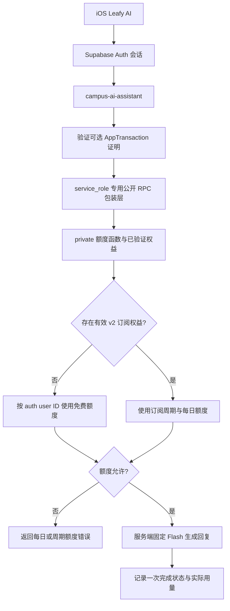

# Leafy AI 免费额度鉴权与回复链路

本文记录 Leafy AI 服务端 Flash 模式的当前身份、额度和回复链路，以及 2026 年 7 月对 `401 App Store 安装记录验证失败`、额度 RPC 失败和问候误生成动作卡问题的根因修复。它既是故障复盘，也是后续修改 Leafy AI 鉴权时的约束说明。

## 1. 最终结论

Leafy AI 必须区分两种证明：

- **免费额度身份**：由已经通过 Supabase Auth 认证的用户 ID 提供，不依赖 App Store、TestFlight 或 `AppTransaction`。
- **订阅额度权益**：只能由服务端验证成功的 Apple 订阅交易 JWS 激活，客户端提交的商品 ID、交易 ID 或 `AppTransaction ID` 不能单独授予权益。权益激活后可通过已绑定的 Supabase 用户继续识别，不要求每次 AI 请求都重新提交交易 JWS。

这意味着 Xcode 和 Simulator 无法提供有效 `AppTransaction` 时，用户仍然可以使用北京时间每日 10 次免费额度；但缺少有效 Apple 订阅交易时，绝不能获得每周期 120 次、每日最多 40 次的订阅额度。

## 2. 修复前的故障链

### 2.1 免费请求被 App Store 安装记录阻断

iOS 在调用 `campus-ai-assistant` 前强制读取 `AppTransaction.shared`，后端也把 `app_transaction_jws` 作为必填证明。Xcode 本地安装或 Simulator 无法生成可被生产配置验证的安装记录时，请求在进入模型前就返回：

```text
401 App Store 安装记录验证失败
```

根因是把“免费用户是谁”和“用户是否有 Apple 订阅”错误地绑定成了同一个前置条件。免费额度本来只需要一个可计数且不可由请求正文伪造的用户身份，Supabase Auth 用户 ID 已经满足这一要求。

### 2.2 放开 AppTransaction 后额度 RPC 仍失败

将 `AppTransaction` 改为可选后，401 消失，但真实请求返回通用 429。Edge Function 日志给出了实际错误：

```text
campus-ai-assistant: quota reserve failed Invalid schema: private
```

额度函数位于 `private` schema。Supabase Data API 没有暴露该 schema，因此 Edge Function 通过 PostgREST 使用 `.schema("private").rpc(...)` 会在进入额度函数前失败。这个错误不是用户真的触发了频率限制，也不是 DeepSeek 不可用。

### 2.3 普通问候误生成日程动作

免费回复恢复后，`Hi` 能得到正文，但回答中提到“管理日程或提醒”，旧动作兜底逻辑把“用户问题 + AI 回答”一起做关键词匹配，于是错误生成了“添加日程”动作卡。

动作意图必须来自用户原始问题，不能从模型自己的建议中反向推导，否则模型可以无意间为自己创造执行权限。

## 3. 当前请求流程



### 3.1 iOS

`CampusAIManagedEntitlementClient.optionalAppTransactionPayload()` 尝试读取并验证 `AppTransaction`：

- 成功时随请求提交 JWS，供服务端验证。
- Xcode 或 Simulator 中不可用时记录诊断并返回 `nil`，不阻断免费请求。
- Keychain 中的自备 DeepSeek Key 不进入这条服务端链路。

Managed 请求中的 `app_transaction_id` 和 `app_transaction_jws` 因此是可选字段。请求仍必须携带有效 Supabase Auth JWT，后端从 JWT 获取真实用户 ID，而不是信任请求 JSON 中的用户标识。

### 3.2 `campus-ai-assistant`

函数按以下顺序处理请求：

1. 用 Supabase Auth JWT 获取用户 ID。
2. 若存在 `app_transaction_jws`，尝试服务端验证；缺失或验证失败时回落到 Supabase 用户身份，不能凭未验证安装记录授予权益。
3. 使用用户 ID 和可选的已验证 App Transaction ID 预留额度。
4. 额度允许后才调用服务端固定的 Flash 模型。
5. 已开始输出或成功完成时计数；未产生任何回答内容的供应商失败不扣次数。
6. 通过 SSE 返回回复、执行进度和更新后的额度快照。

客户端单独提交的 `app_transaction_id` 不参与权益判定。未验证的 ID 不能把免费额度升级为订阅额度。

### 3.3 `campus-ai-entitlement`

额度查询和订阅同步是两条不同路径：

- 没有订阅交易 JWS：只查询当前 Supabase 用户的额度快照，`AppTransaction` 可选；该查询不会主动清除服务器上仍有效的订阅权益。
- 存在订阅交易 JWS：必须由服务端验证 Apple 签名、Bundle ID、App Apple ID、商品和环境；验证成功后，从交易本身取得可信的 App Transaction ID 并同步订阅权益。
- 无效、过期、退款、撤销或旧 Product ID 均不得授予 v2 订阅权益。

当前唯一支持的商品是 `com.isaachuo.leafy.ai.weekly.v2`。

## 4. private schema 的安全访问

额度表和真实业务函数继续保留在 `private` schema，不把整个 schema 暴露给 Data API。迁移 `20260716062000_campus_ai_edge_rpc_wrappers.sql` 在 `public` schema 提供四个薄包装函数：

- `edge_campus_ai_quota_snapshot`
- `edge_campus_ai_reserve_quota`
- `edge_campus_ai_complete_usage`
- `edge_campus_ai_sync_entitlement`

这些函数具有以下安全约束：

- 使用 `SECURITY DEFINER`，且 `search_path` 设为空。
- 内部调用全部使用 `private.<function>` 完整限定名。
- 对 `public`、`anon` 和 `authenticated` 撤销执行权限。
- 只授予 `service_role` 执行权限。
- `service_role` 只存在于 Edge Function 服务端，绝不进入 iOS、网站前端或公开配置。

因此“函数位于 public schema”不等于“普通客户端可以调用”。公开的是 PostgREST 可发现的入口，执行权仍被数据库角色限制。

可用以下查询核对边界：

```sql
select
  has_function_privilege(
    'service_role',
    'public.edge_campus_ai_quota_snapshot(uuid,text,timestamptz)',
    'EXECUTE'
  ) as service_role_can_execute,
  has_function_privilege(
    'authenticated',
    'public.edge_campus_ai_quota_snapshot(uuid,text,timestamptz)',
    'EXECUTE'
  ) as authenticated_can_execute;
```

期望结果为 `true, false`。

## 5. 动作卡的权限边界

动作规划现在只依据用户原始消息判断是否存在明确意图：

- 用户明确提出“添加、创建、设置日程”等请求时，可以生成待确认的 `createSchedule` 动作。
- 用户明确提出“查看、打开、管理考试或日程”等请求时，可以生成对应页面动作。
- 普通问候、知识问答或仅由 AI 回答提到日程时，不生成动作。
- 即使生成动作，也必须由用户点击并在原生表单中保存后才算执行。

服务端在不需要动作、也没有手动开启卡片时直接跳过动作规划，减少一次无意义的模型请求。BYOK 路径同样在展示前按用户原始问题过滤动作。

## 6. 诊断与状态码

关键路径只记录结构化状态，不记录 JWS、证书、API Key 或完整用户问题：

| 事件或日志 | 含义 |
|---|---|
| `campus_ai_app_transaction_unavailable` | 当前环境没有安装记录，使用 Supabase 用户免费身份 |
| `campus_ai_apple_verification_failed` | Apple JWS 或服务器证书/环境配置验证失败 |
| `quota reserve failed` | 额度 RPC 或数据库预留失败，不应直接当成真实限流 |
| DeepSeek Key count | 只记录去重后的 Key 数量，不记录内容 |

主要响应状态：

| HTTP 状态 | 含义 |
|---|---|
| `401` | Supabase Auth 无效，或明确提交的订阅交易 JWS 验证失败 |
| `402` | 当日免费/订阅额度或订阅周期额度已用完 |
| `429` | 额度预留或服务限流类失败，需要结合函数日志判断根因 |
| `503` | 服务端模型 Key 数量或 AI 服务配置未完成 |

排查时应先确认错误发生在 Auth、额度预留、Apple 验证还是模型调用阶段，不要用统一的“服务不可用”掩盖不同故障。

## 7. 验证方式

### 7.1 Deno

```bash
deno fmt --check \
  supabase/functions/campus-ai-assistant/index.ts \
  supabase/functions/campus-ai-assistant/index.test.ts \
  supabase/functions/campus-ai-entitlement/index.ts \
  supabase/functions/campus-ai-entitlement/index.test.ts

deno check \
  supabase/functions/campus-ai-assistant/index.ts \
  supabase/functions/campus-ai-entitlement/index.ts

deno test --allow-env \
  supabase/functions/campus-ai-assistant/index.test.ts \
  supabase/functions/campus-ai-entitlement/index.test.ts
```

测试至少覆盖：缺少 AppTransaction 时免费请求成功、无效 AppTransaction 不授予订阅权益、裸 ID 不能伪造权益、有效交易可同步、普通回答不会从 AI 自己的正文推导动作。

### 7.2 Swift 与 Simulator

聚焦测试覆盖 Managed 请求缺少 AppTransaction 时仍可编码，以及普通问候不生成动作。真实验收步骤：

1. 免费用户在 Simulator 发送 `Hi`。
2. 收到 Flash 正常回复，无 401、429 或 503。
3. “今日免费剩余”减少一次。
4. 退出并重新启动 App，再次发送仍成功。
5. 回复下方不出现无关日程动作卡。

2026 年 7 月修复验收中，Simulator 连续成功回复，额度从 `9/10` 变为 `8/10`，冷启动后再次变为 `7/10`。

## 8. 代码位置

| 职责 | 文件 |
|---|---|
| iOS Managed 请求与 BYOK 动作过滤 | `leafy/Features/Discover/Domain/CampusAIAssistantSupport.swift` |
| AppTransaction 与订阅同步 | `leafy/Features/Discover/Domain/CampusAIManagedEntitlement.swift` |
| 服务端回复与额度预留 | `supabase/functions/campus-ai-assistant/index.ts` |
| 订阅交易验证与权益同步 | `supabase/functions/campus-ai-entitlement/index.ts` |
| 数据库安全包装层 | `supabase/migrations/20260716062000_campus_ai_edge_rpc_wrappers.sql` |
| Swift 回归测试 | `leafyTests/CampusAIAssistantTests.swift` |
| Deno 回归测试 | `supabase/functions/campus-ai-assistant/index.test.ts`、`supabase/functions/campus-ai-entitlement/index.test.ts` |

后续改动不得重新把免费额度绑定到 App Store 安装记录，也不得为了让 Edge Function 访问额度函数而暴露整个 `private` schema。
