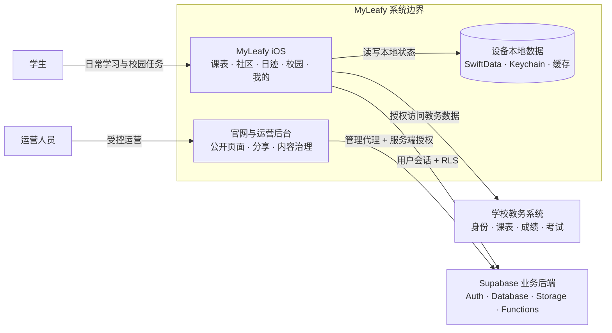
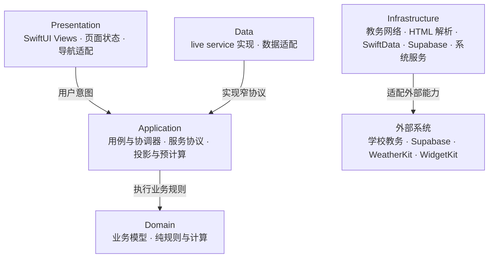

# Architecture

本文基于当前 `main` 代码整理，描述 **MyLeafy 现在实际的结构**。它不是未来方案：尚未实现的架构应进入 `docs/`。若本文与代码冲突，以代码为准，并请按 `state/README.md` 的维护原则更新本文。

Last verified: 2026-08-29

## 1. 系统组成

架构目标：MyLeafy 同时面对三类性质不同的系统（不稳定的学校网页、强调本地体验的 iOS 客户端、需要严格授权的云端社区与运营业务），因此架构重点是隔离变化，分层数量由实际职责决定。

| 运行单元 | 部署位置 | 职责 |
|---|---|---|
| MyLeafy iOS App | 用户设备 | 学校登录、教务数据获取、本地持久化、用户交互与普通 Supabase 业务 |
| MyLeafy Android App | 用户设备 | 同 iOS 的产品行为，Android 原生实现（Kotlin/Compose/Room/OkHttp/supabase-kt），见 `docs/engineering/android-migration.md`；已含教务登录/课表/成绩/考试、社区 Feed/详情/评论/发帖、我的资料与空闲教室 |
| 学校教务系统 | 学校基础设施 | 身份、课表、成绩、考试、教学计划等权威教务数据（非稳定 API） |
| Supabase | 托管云服务 | Auth、PostgreSQL、RLS、Storage、Realtime、Edge Functions |
| 官网与运营后台 | Cloudflare Pages | 公开页面、分享落地页、管理界面与管理 API 代理 |
| Widget / Share / 导入扩展 | 系统扩展 | 课表小组件、系统分享、外部学习资料导入 |



## 2. iOS App 入口与启动

入口：`leafy/App/leafyApp.swift`（`@main struct LeafyApp`）。

启动流程（`leafyApp` + `ContentView`）：

1. 迁移外观、主题色、显示密度、语言等偏好。
2. `AppModelContainerFactory` 创建 SwiftData `ModelContainer`；store 损坏时备份后重建，必要时降级内存 store。
3. 恢复校园上下文与学校身份缓存（`ActiveCampusContext`，位于 `leafy/Core/Campus/CampusModels.swift`）。
4. 无有效学校身份进入 `LoginView`，否则进入 `ContentView`。
5. `ContentView` 渲染根 `TabView`，按校园 capability 决定社区入口是否可见。
6. 进入前台或用户主动刷新时更新学期配置、社区通知计数和必要数据。

`leafy/App/` 中的其他协调器：

- `AppNavigationCoordinator`：根 Tab、校园一级领域、共享课表、Widget 与分享链接等跨功能导航，以及 `leafy://` / `myleafy.space` 深链路由。
- `AppLifecycleCoordinator` / `AppSessionResetter`：前后台生命周期、会话清理。
- `AppLocalization` / `AppBrand`：语言偏好与品牌资源。
- `LeafyNotificationCoordinator` / `ScheduleReportBackgroundRefreshCoordinator`：通知与日程报告后台刷新。
- `ReviewDemoMode`：App Store 审核演示账号/数据模式。
- `AppStoreReviewCoordinator`：App Store 评分与更新检查。
- `App/Theme/`：`AppTheme`、`AppChrome`、`LeafyAppIconManager`、`Color+Hash` 等视觉基础设施。

## 3. 目录结构与模块地图

```text
leafy/
├── App/                    # 应用入口、根导航、生命周期、主题
├── Core/                   # 跨功能基础设施
│   ├── Campus/             # 校园标识、capability、数据作用域（ActiveCampusContext）
│   ├── Dependencies/       # LeafyDependencies 组合根（仓储/天气/图片/Widget 注入）
│   ├── Persistence/        # AppModelContainerFactory（SwiftData 容器）
│   ├── Concurrency/        # PerformanceSignposter 等
│   ├── ImageProcessing/    # 图片处理与头像缓存
│   └── Widget/             # WidgetSnapshotPublisher
├── Features/               # 按用户能力组织
│   ├── Auth/               # LoginView
│   ├── Timetable/          # 课表（Domain/Application/Presentation）
│   ├── Community/          # 社区（Domain/Application/Data/Presentation）
│   ├── Schedule/           # 日迹：随记/日程/推送/记录日迹（Domain/Data/Presentation）
│   ├── Discover/           # 校园：AcademicHub/AcademicTools/LearningWorkspace/WeekendTravel
│   └── Profile/            # 我的（Domain/Application/Presentation）
├── Services/               # 外部系统边界（教务、Supabase、同步、诊断）
├── Parsers/                # SwiftSoup 教务 HTML 解析
├── Shared/                 # 跨功能模型、平台兼容、扩展共享数据
└── WidgetSupport/          # Widget 展示数据构建
android/                    # Android 原生客户端（单 app module，Material 3 根导航与功能分层）
```

## 4. 分层与依赖方向



- Feature 依赖方向固定为 `Presentation → Application → Domain`。
- `Data` 实现 Application 层定义的窄协议；`Domain` 不依赖 SwiftUI、Supabase 或具体持久化。
- 组合根（`Core/Dependencies/AppDependencies.swift`）负责把 `Data` 实现注入页面。
- 历史代码仍有部分跨层文件；新增代码遵守依赖方向，旧文件只在相关功能改动时迁移。

## 5. Feature 概览

### Auth — `Features/Auth/`

`LoginView`：三个入口——北林入口（学号/密码/验证码，登录逻辑由 `Services/SchoolNetworkManager*` 提供）、通用学校入口（邮箱注册/登录，`CustomCampusAuthService`）、免登录入口（`guest` 身份，无账号，`SchoolNetworkManager.persistGuestIdentity`）。另有演示模式。

免登录（`guest`）身份：`CampusID.guest` + `CampusIdentityKind.guest`，`isCustom` 为 true 且带独立 scopeKey；数据全部保存在本机，不发起任何后台请求（`SemesterConfig` 远程拉取与 `CommunityPublishCoordinator` 均按能力跳过），无社区能力。

### Timetable — `Features/Timetable/`（课表）

- `Domain/`：`AcademicYearTimetable`、`TimetableGridSnapshot`、`WeeklyTimetableProjection`、`TimetableScheduleProjectionSnapshot`、`TimetableWeatherAdvice`、`SemesterConfig`、`Course` 等模型与纯计算。
- `Application/`：`TimetableRefreshUseCase`、`SchoolTimetableRepository`、`TimetableCalendarExportService`、`TimetableWeatherServicing`。
- `Presentation/`：`Screen/TimetableView`（主界面）、`Grid/TimetableScrollContainer`（UIKit 桥接）、`Agenda`、`Processing`、`Sheets`、`Share`。

### Community — `Features/Community/`（社区）

- `Domain/`：帖子/评论/草稿等模型。
- `Application/`：`CommunitySessionManager`（会话与 profile 生命周期）、`CommunityRepository`、`CommunityPublishCoordinator`、`CommunityPostDraftRepository`、`RatingCatalogWorkspace`、`CommunityAccessGate` 等。
- `Data/`：`Supabase/` 下各 `*Service` 与 `Live*Repository`；Feed Realtime 只发送校园范围的变更信号，完整列表仍由 `community-feed` 获取；`Local/LocalCommunityPostDraftRepository`。
- `Presentation/`：Feed、详情、发布、通知、投票、`Ratings/`（评教/评课/评菜）。Feed 在社区 Tab 活跃时预取变更快照，用户通过“有新内容”入口应用，手动刷新提供显式结果反馈。

### Schedule — `Features/Schedule/`（日迹）

随记（memo）、个人日程、推送与记录日迹，按校园身份作用域保存在本地：

- `Domain/`：`ScheduleMemoModels`、`PersonalScheduleYearTimeline`、`ScheduleMemoMarkdownDocument`。
- `Data/`：`ScheduleMemo*Store`（图片、附件、音频、导出、删除、语音转写）。
- `Presentation/`：`ScheduleRootView`（随记/日程/推送三段顶部导航，侧栏记录日迹/每日回顾/标签/导出/回收站/日程推送）、写作与高级编辑器、音频视图、统计视图、分享卡片。
- 升级后新建的个人日程保留单一数据源，并通过 `PersonalScheduleFeedItem` 投影到随记流；投影只参与卡片展示、搜索和排序，不进入随记统计、回顾、标签、导出或回收站。缺少真实 `createdAt` 的旧日程只留在日程列表。

### Discover — `Features/Discover/`（校园）

校园一级领域与工具：

- `AcademicHub/`：校园主入口（一级领域切换）。
- `AcademicTools/`：成绩、考试、自习安排（空闲教室/热力图/座位预约）、学校教学、体育、职业规划、考研、评价、医疗、周末出行等。
- `LearningWorkspace/`：学习空间、专注记录、外部资料导入。
- `WeekendTravel/`：周末去哪。
- `Domain/` 与 `Application/` 提供投影、规则与服务协议（成绩快照、综素规则、教室查询、热力图、日程报告等）。

### Profile — `Features/Profile/`（我的）

- 社区资料、个人内容列表（帖子/评论/点赞/收藏/投票）。
- 共享课表、课表背景设置、邮箱绑定。
- 个性化、缓存同步、退出登录。
- 帮助与资源中的权限管理：集中展示定位、通知、日历、相机、麦克风、语音识别与添加到照片的系统授权状态；仅在用户点按具体项目时请求，已关闭的授权跳转 App 系统设置。

## 6. Services 与 Parsers

### `leafy/Services/`

- `SchoolNetworkManager.swift` + `+Core/+Auth/+Timetable/+Discover.swift`：强智登录、Cookie 管理、教务请求、页面识别、会话失效。
- `SchoolAuthenticationService` / `SchoolReauthentication`：用户主动教务操作的 Session-first 恢复协调；本科最多执行三轮“刷新验证码 → 三路端侧 Vision 共识 → 登录验证”，只对 OCR 不可靠或明确验证码错误继续，研究生与最终失败进入人工验证，校园网不可达只提示连接后重试。
- `AcademicOperationProgress`：页面局部的用户主动教务操作进度；记录已完成、进行中和失败步骤，认证层与具体数据用例通过 MainActor reporter 汇入，同一模型不用于后台预取。
- `SchoolDataSyncService` / `SchoolDataPrefetchCoordinator`：教务数据同步与预取。
- `SchoolLoginCredentialStore` / `SchoolSessionCredentialStore`：学校凭据与会话存储。
- `TimetableWebViewBootstrapper`：课表 HTTP 路径失败后的 `WKWebView` 兼容路径。
- `CustomCampusImportService`：自定义校园导入。
- `Supabase/`：`LeafySupabase`、`SupabaseConfig`、`SupabaseBackendClient`、`TimetableSharingService`、`CustomCampusAuthService`、`PostgraduateInfoService`。
- `Diagnostics/DebugNetworkDiagnostics`：开发诊断。

### `leafy/Parsers/`

`HTMLParser.swift` + `HTMLParser+Debug.swift`，使用 SwiftSoup 将学校 HTML 转换为业务模型；解析器不负责页面导航、持久化或用户提示。

## 7. 关键数据流

### 教务链路（学校 → 本地）

```text
SchoolNetworkManager（URLSession 主链路 / WKWebView 课表兼容）
  → 现有 Cookie 直接请求；明确 Session 过期后才进入认证恢复
  → 本科最多三轮验证码刷新与同图三路 Vision 共识 / 人工验证码 fallback
  → HTMLParser（SwiftSoup → Course/Grade/考试/教室等模型）
  → SwiftData 本地缓存
  → TimetableGridSnapshot 等展示投影 → SwiftUI / Widget
```

失败分类至少四类：网络不可达、学校会话失效、非预期中间页、DOM 无法解析。同步结果区分完整成功、部分成功与失败，只有真实成功的数据范围发布刷新通知；部分或全部失败进入短失败冷却。解析器只有在确认目标页面结构完整且确实无记录时才返回可信空结果，未知页面或非空但无法解析的结构必须失败并保留最近成功缓存。学校数据是权威来源，SwiftData 是本地副本。

本地持久化（SwiftData，容器由 `AppModelContainerFactory` 集中创建）的权威关系：

- 学校课表和成绩的权威来源仍是学校系统，SwiftData 是本地副本。
- 用户创建的备注、提醒、随记、个人日程等以本地数据为权威。
- 社区帖子和通知以 Supabase 为权威，不复制为完整 SwiftData 数据库。

课表渲染性能：`TimetableGridSnapshot` 等预计算布局输入、一次构造并贯穿缓存的 `TimetableRenderInput`、按 `(week, day)` / `(week, day, period)` 建立的提醒索引、稳定课程颜色索引，以及 Widget 专用共享数据（扩展不直接访问主 App SwiftData 上下文）。

### Supabase 业务链路（本地 → 云端）

```text
学校登录成功
  → 匿名 Supabase Auth 会话
  → community-bootstrap-user（按 auth.uid() + campus_id + edu_id 建立 profile）
  → 窄仓储协议（Features/Community/Data/Supabase/*Service）
  → RLS + 校园作用域 + 所有权约束
```

`(campus_id, edu_id)` 唯一确定长期 profile；多设备匿名会话自动继承同一 profile。Supabase 不替代学校登录，也不是学校课表/成绩/考试的权威来源。

### 运营后台链路（浏览器 → Cloudflare → Edge Functions）

```text
React-admin（site/src/admin）
  → /api/admin/*（同域 Cloudflare Pages Functions：HttpOnly Cookie + CSRF + Origin 校验）
  → Supabase Edge Functions（admin-login / admin-me / admin-community / admin-export 等）
  → PostgreSQL / Storage / 审计
```

浏览器不持有服务端密钥，管理会话保存在 HttpOnly Cookie。`site/functions/api/admin/[[path]].js` 与 `site/functions/share/[[path]].js` 是 Pages Functions 代理。

## 8. 导航与深链

- 根 Tab：`TabView`，顺序 `课表 / 社区 / 日迹 / 校园 / 我的`，默认课表；社区按校园 capability 隐藏（`ContentView.swift`，iOS 26 用系统 `Tab` API，低版本用 `tabItem`）。
- 层级详情使用 `NavigationStack`；轻量编辑/筛选/详情使用 sheet。
- `AppNavigationCoordinator` 统一处理根 Tab、校园领域、共享课表邀请码、社区帖子、Widget 深链、日程报告入口。
- Android 使用 `MyLeafyNavHost` + `RootTab` 固定呈现 `课表 / 社区 / 日迹 / 校园 / 我的`，默认直接进入课表；底部 `NavigationBar` 只在根目的地显示并保存各 Tab 状态。
- Android 二级真实页面与 `FeatureDestination` 占位页面统一使用返回式 Top App Bar。占位页只表达未接入状态，不生成业务数据；帮助中心、权限说明、关于与内置校历是可离线使用的完整静态页面。
- Android 启动阶段不强制登录；学校登录从“我的”进入。Room、教务和 Supabase 页面只展示各自真实数据，未登录、未配置或校园网不可达时进入明确的 Empty/Error 状态。
- Android 本科验证码阶段使用只驻留内存的匿名 Cookie；key、验证码与登录提交复用同一会话，认证成功后才按 `CampusIdentity.scopeKey` 迁移到 Keystore。同步 OkHttp 请求由客户端统一切换到 `Dispatchers.IO`，Compose ViewModel 不执行阻塞网络 I/O。
- Android 当前仅实现直接 HTML 课表解析；学校返回未识别页面时 fail-fast 为 `TimetableDataUnavailable` 并保留 Room 最近成功缓存，不把未知页面当空课表。iOS 的表单/WebView bootstrap 回退尚未迁移。
- 深链支持 `leafy://` 与 `https://myleafy.space/` 白名单路由，解析器验证 host、路径、UUID 或邀请码格式。

## 9. 扩展

| 扩展 | 位置 | 说明 |
|---|---|---|
| Widget | `leafyWidget/` + `LeafyWidgetShared/` + `leafy/WidgetSupport/` | “MyLeafy 课表”小号/中号，通过 App Group 共享展示数据，App Intent 切换今/明 |
| Share | `LeafyShareExtension/` | 系统分享，消费显式共享模型 |
| External Import | `LeafyExternalImportShared/` | 外部学习资料导入共享逻辑 |

Widget 与扩展不直接访问主 App SwiftData 上下文，消费 `WidgetSnapshotPublisher` / `LeafyWidgetSnapshotBuilder` 写入的展示数据。

## 10. Supabase 与 Web/运营后台边界

- `supabase/`：84 个 migration、19 个 Edge Functions、`schema-ledger.md`（关键 schema 不变量与迁移顺序的事实来源）、模板与测试。
- 主要函数组：社区初始化与 Feed（`community-bootstrap-user`、`community-feed`）、校园服务（`campus-request`、`campus-weather`）、分享（`share-preview`）、媒体验证与清理、管理（`admin-*`）。
- `site/`：官网（React + Vite）+ React-admin 运营后台 + Cloudflare Pages Functions；后台 `lazy()` 独立加载。
- 高权限操作必须经过服务端认证、授权、参数校验与审计；iOS/前端只用 publishable key。

## 11. 当前行为约束

以下是不变量，修改代码前必须遵守（与 `docs/` 中的设计细节不同，这些是当前必须成立的事实）：

- 根导航顺序固定为 `课表 / 社区 / 日迹 / 校园 / 我的`；底部 Tab 使用原生 `TabView`，不叠加透明度伪造淡入过渡；iOS 26 使用系统 Liquid Glass 增强，低版本保留稳定回退。社区 Tab 按校园 capability 隐藏。
- 免登录（guest）入口完全本地：不创建任何账号，不连接 Supabase 或我们的后台；学期/校历配置使用 App 内置默认（1–20 周容器），课程、成绩与考试由用户手动添加/导入；随记、日程等按 `guest` 身份作用域存于本机，退出登录后数据保留。
- 日迹顶部直接提供 `随记 / 日程 / 推送`；侧栏“记录”分组把 `记录日迹` 放在 `每日回顾` 上方；日程使用个人日程列表，不另设自然年周视图。
- 随记按校园身份作用域保存在本地（元数据、Markdown 源文、图片、附件、音频、标签、统计）；不进入社区、Widget、日历导出或课表分享图。语音转写设备端完成且不持久化原始输入。学校课程、考试、校历不进入随记或个人日程列表。
- 课表按单个学年浏览，从秋季学期首日到下一学年开始前一天；暑假最后一周停在学年边界，下一学年通过学年/日期选择进入。学校单学期课表保持 20 周数据集；学期结束与寒暑假区间来自语义校历事件，不用 20 周容器反推。
- 课表周态与三日态使用同一棵 `TimetableContinuousColumnsLayout` 日期列树，由 `TimetableContinuousViewportController.zoomProgress` 连续驱动，不切换容器、不用 `scrollTo` 居中。本周以今天为三日中心，其他周以周二为中心；三日分页每次移动三个自然日，缩回当前中心日期所属周。隐藏周末只把周态周末 lane 收到零宽，三日态仍展示真实周末。21 日渲染窗口及课程、考试、日程 payload 在交互期间冻结，Header、网格和卡片共用 `TimetableZoomGeometry`。
- 时间视图主要展示最新秋季学期，并通过“过往学期与假期”按学年回看历史课程；当前历史范围为 2025–2026 春季学期与随后暑假，均可按周选择。年度缩略固定按 1–12 月自然顺序，1–8 月映射学年结束年、9–12 月映射学年起始年；学期颜色优先于寒暑假颜色。
- 远程学期运行配置（`semester_runtime_configs`）选择本科 `semester_id` / 研究生 `graduate_timetable_term_code`、首周日期与语义时间线，无需发布 App 版本。`is_active` 表示学校已允许拉取的目标学期，可早于正式开学日人工切换；正式周次仍只由 `semester_start_date` 计算。
- 学校课表按 `sourceSemesterID` 分学期替换并保留历史学期；课程备注、课次备注和课程提醒使用学期作用域键，切换最新学期不得删除或串用历史本地记录。
- 用户主动发起教务请求时必须优先复用当前 URLSession/Cookie，不发送额外的联网 Session 预检。只有服务端明确确认 Session 失效才进入恢复；校园网不可达不得清除 Cookie 或触发验证码。后台预取不主动认证。
- 无 Session 时通过学校验证码端点是否可访问判断网络条件；校园网不可达只提示连接 `bjfu-wifi` 或北林 VPN 后再次操作，不进入人工验证码 sheet，也不监听网络变化自动重试。
- 本科自动恢复使用 Keychain 中与当前身份匹配的账号密码；总共最多三轮，每轮重新获取一张验证码及其 Session，并在同一 URLSession 内完成原图、四倍 Lanczos 放大图、四倍放大灰度增强图识别和登录提交。字母统一为小写，至少两路得到相同的 `[a-z0-9]{4}` 且最低置信度不低于 0.85 时才提交。OCR 不可靠不提交登录并刷新下一张；学校明确返回验证码错误时进入下一轮；账号密码、校园网和未知错误立即停止。第三轮仍失败时人工输入，若第三轮已提交则额外获取一张不再 OCR 的人工验证码。研究生端不做自动 OCR。
- 用户主动教务操作必须展示与实际请求范围一致的步骤历史：课表只显示课表步骤，成绩只显示成绩步骤，“我的”显示全量步骤，教学与培养一次刷新两类数据，空教室只显示身份恢复与当前查询。单步失败不得被后续步骤覆盖；后台预取不展示进度。
- 多步骤教务同步只有解析、保存或单页面结构异常可以记录失败后继续；一旦学校请求确认校园网不可达，必须立即终止剩余请求、关闭进度卡并提示连接 `bjfu-wifi` 或北林 VPN 后重试，最近成功缓存继续保留。
- 校园一级领域包括 `自习安排` 与 `学习空间`；`空闲教室` 是 `自习安排` 下的内部工具；专注记录归 `学习空间`。
- 校园热力图不内置全学期占用数据：用户显式登录并按需更新所选日期和节次；每个校园账号只保留最近一次成功更新的数据；文案使用“更新数据 / 上次更新”。
- 一个 `(campus_id, edu_id)` 对应一个长期 community profile；多个可替换的设备 Auth 会话可链接同一 profile，一个 Auth 会话最多映射一个 profile。学校登录自动继承匹配的社区资料；已验证绑定邮箱仅用于通知，不参与登录或社区恢复。
- 社区 Feed 以 `community-feed` 响应为权威；Realtime 仅触发校园范围的后台预取，不直接增量拼装列表。预取结果在用户点击“有新内容”后应用；用户下拉刷新必须反馈更新、最新、可信空结果、部分失败或失败，并在失败时保留最近成功数据。
- 帖子与评论通过校验 RPC 创建，并以 community actor + 客户端 request ID 幂等重放；发帖队列在重试中复用稳定 UUID，评论内容与回复目标未变化时复用 request ID，超时重试不重复落库或通知。举报从不自动隐藏内容；图片帖使用短期单次服务端验证凭证，图片与附件全部完整且数量匹配后原子发布。评论最多两层。
- 共享课表是一次性邀请码 + 只读授权；明文邀请码短暂展示，数据库保存 hash；不上传成绩、备注、提醒。
- 课表背景、个性化设置保存在本机，不进入分享图或 Widget。
- 照片背景未显式选择显示模式时默认完整显示；启用状态下替换照片通过最终配置通知立即刷新课表根背景层。
- 投票选项票数和比例对未投票用户同样可见；所有投票卡片展示文字百分比与进度，选中状态不只依赖颜色。
- 北京林业大学 2026–2027 第一学期阳光长跑使用 2026-09-07 至 2027-01-15，默认两周四次、总目标 34 次，整周跳过第 3、4、5、17 周。
- 天气建议仅在用户主动打开后直接请求“使用 App 期间”的系统定位权限，不显示自定义预授权提示；用户可在系统弹窗中拒绝，已拒绝时仅提供系统设置入口且不循环提示授权。
- 高密度视图遵循预计算投影（一次构建 `TimetableRenderInput`、按 `(week, day)` 索引、缓存投影），避免在 SwiftUI `body` 中重复过滤排序。
- 性能声明要求三次可比运行、中位数改善至少 10%、峰值内存回退不超过 5%、无新增 app-owned 泄漏；signpost 不含用户内容。

### 校园能力与配置

- `ActiveCampusContext`、校园描述和 capability 决定功能可见性与服务实现（`Core/Campus/`）。页面通过能力查询决定是否展示入口，校园差异不散落字符串判断。
- 校园描述符：`bjfu`、`custom`（通用学校入口）、`guest`（免登录入口）。`guest` capabilities 仅 `timetable/grades/exams`，无 `community`/`authentication`；`CampusIdentity.isCustom` 对 `guest` 同样成立。
- 服务端数据始终带校园作用域（`campus_id`），不能只依赖客户端过滤。
- 学期配置回退顺序：远程 active 配置 → 最近成功缓存 → App 内置默认值。

### 架构约束（新增/重构代码时必须满足）

1. View 不直接解析 HTML、构造管理请求或持有服务端密钥。
2. 学校数据、MyLeafy 云端数据和用户本地数据不得混淆权威来源。
3. 校园差异通过描述、能力或适配器表达。
4. 跨功能导航通过协调器或稳定深链，不通过 View 层互相持有。
5. 高权限操作必须经过服务端认证、授权、参数校验和审计。
6. 新功能必须定义 Loading、Empty、Error、Unauthenticated 和恢复行为。
7. 行为或边界变化时同步更新文档、测试与 `state/`。

### 可观测性与恢复

- 使用 `Logger` 与 performance signpost 记录可诊断事件；网络日志默认脱敏，不记录密码、Cookie、验证码和完整 token。
- 服务端管理请求携带 request ID，错误界面用其定位。
- 本地 store 损坏、教务会话过期、Supabase 配置缺失和网络不可达都有独立恢复路径；错误状态保留最近成功数据，除非继续展示会误导用户。

## 12. 测试与 CI

| 范围 | 位置 |
|---|---|
| iOS 单元/契约测试 | `leafyTests/`（XCTest，Domain/Application/Presentation 分层覆盖） |
| Android 单元/导航测试 | `android/app/src/test/`（JVM 契约）与 `android/app/src/androidTest/`（Compose 根导航烟雾测试） |
| 教务解析回归 | 固定 HTML 样本测试 |
| Supabase 数据库 | `supabase/tests/`（migration replay、RLS、拒绝路径） |
| Edge Functions | Deno typecheck / 单元 / 契约测试 |
| Web | `site/`（TypeScript typecheck、Vitest、Playwright） |

CI 位于 `.github/workflows/`：`ios-ci`、`site-ci`、`supabase-ci`、`repository-safety`，按改动范围触发。

## 13. 与其他文档的关系

- 详细工程设计与决策 rationale：`docs/engineering/`（`supabase.md`、`admin-console.md`、`admin-backend-reliability.md`）。
- 产品定位与设计：`docs/product/`、`docs/design/`。
- 当前进度与重点：`state/CURRENT.md`。
- 可复用排查知识：`logs/`。

> 本文是“当前结构”的唯一权威入口。如果代码发生变化，先更新本文；`docs/engineering/` 中描述实现细节的文档按 `docs/README.md` 的规则保持同步。
