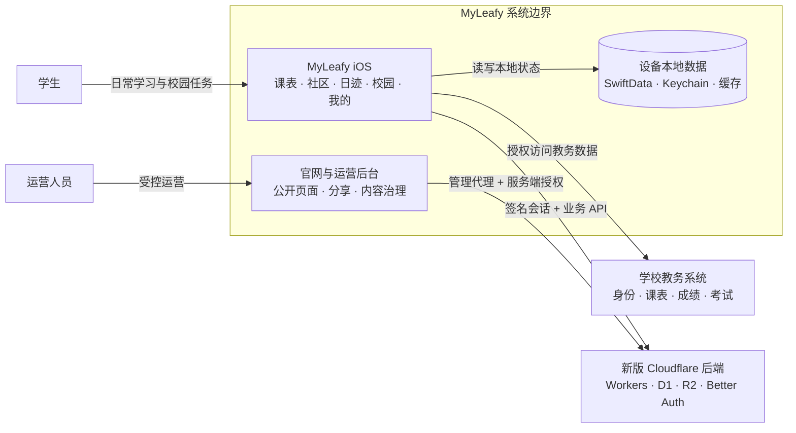
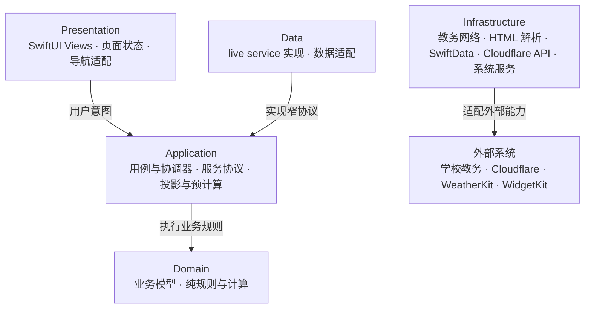

# Architecture

本文基于当前 `main` 代码整理，描述 **MyLeafy 现在实际的结构**。它不是未来方案：尚未实现的架构应进入 `docs/`。若本文与代码冲突，以代码为准，并请按 `state/README.md` 的维护原则更新本文。

Last verified: 2026-09-30 (Android; validation boundaries in CURRENT.md)

## 1. 系统组成

架构目标：MyLeafy 同时面对三类性质不同的系统（不稳定的学校网页、强调本地体验的 iOS 客户端、需要严格授权的云端社区与运营业务），因此架构重点是隔离变化，分层数量由实际职责决定。

| 运行单元 | 部署位置 | 职责 |
|---|---|---|
| MyLeafy iOS App | 用户设备 | 学校登录、教务数据获取、本地持久化；新版云端业务通过 URLSession 调用 Cloudflare `/v1` API |
| MyLeafy Android App | 用户设备 | Android 原生实现（Kotlin/Compose/Room/WorkManager/AlarmManager/OkHttp），见 `docs/engineering/android-migration.md`；已含教务登录与首次同步、固定左轴周课表/天气/背景/课程备注与提醒/个人日程/ICS、日迹通知与标签/统计/回顾/回收站/导出、成绩分析/考试/教学计划与培养方案、社区（文本与图片帖）、共享课表、体育/医疗/评价、综素测算、荣誉记录、资料与设置 |
| 学校教务系统 | 学校基础设施 | 身份、课表、成绩、考试、教学计划等权威教务数据（非稳定 API） |
| Cloudflare 新后端 | Workers / D1 / R2 / Durable Objects | Hono 业务 API、Better Auth、SQL 授权、文件、实时变更信号、Cron；新版服务已启用，旧版 App 的 Supabase 服务并行保留 |
| Supabase 旧生产后端 | 托管云服务 | 已发布旧版 iOS / Android 使用，新 Android 源码不再接入；独立保持运行，作为旧版数据权威及迁移源，与新版暂不实时同步 |
| 官网与运营后台 | Cloudflare Pages | 公开页面、分享落地页、管理界面与管理 API 代理 |
| Widget / Share / 导入扩展 | 系统扩展 | 课表小组件、系统分享、外部学习资料导入 |


```mermaid
flowchart LR
    Student["学生"]
    Operator["运营人员"]

    subgraph Product["MyLeafy 系统边界"]
        direction TB
        IOS["MyLeafy iOS<br/>课表 · 社区 · 日迹 · 校园 · 我的"]
        Local[("设备本地数据<br/>SwiftData · Keychain · 缓存")]
        Web["官网与运营后台<br/>公开页面 · 分享 · 内容治理"]
        IOS -->|读写本地状态| Local
    end

    School["学校教务系统<br/>身份 · 课表 · 成绩 · 考试"]
    Backend["新版 Cloudflare 后端<br/>Workers · D1 · R2 · Better Auth"]

    Student -->|日常学习与校园任务| IOS
    Operator -->|受控运营| Web
    IOS -->|授权访问教务数据| School
    IOS -->|签名会话 + 业务 API| Backend
    Web -->|管理代理 + 服务端授权| Backend
```

## 2. iOS App 入口与启动

入口：`leafy/App/leafyApp.swift`（`@main struct LeafyApp`）。

启动流程（`leafyApp` + `ContentView`）：

1. 迁移外观、主题色、显示密度、语言等偏好。
2. `AppModelContainerFactory` 创建 SwiftData `ModelContainer`；store 损坏时备份后重建，必要时降级内存 store。
3. 恢复校园上下文与学校身份缓存（`ActiveCampusContext`，位于 `leafy/Core/Campus/CampusModels.swift`）。
4. 无有效学校身份进入 `LoginView`，否则进入 `ContentView`。
5. `ContentView` 渲染根 `TabView`，按校园 capability 决定社区入口是否可见。
6. 进入前台或用户主动刷新时更新学期配置、社区通知计数和必要数据。

`leafy/App/` 中的其他协调器：

- `AppNavigationCoordinator`：根 Tab、校园一级领域、共享课表、Widget 与分享链接等跨功能导航，以及 `leafy://` / `myleafy.space` 深链路由。
- `AppLifecycleCoordinator` / `AppSessionResetter`：前后台生命周期、会话清理。
- `AppLocalization` / `AppBrand`：语言偏好与品牌资源。
- `LeafyNotificationCoordinator` / `ScheduleReportBackgroundRefreshCoordinator`：通知与日程报告后台刷新。
- `ReviewDemoMode`：App Store 审核演示账号/数据模式。
- `AppStoreReviewCoordinator`：App Store 评分与更新检查。
- `App/Theme/`：`AppTheme`、`AppChrome`、`LeafyAppIconManager`、`Color+Hash` 等视觉基础设施。
- `Resources/AppIcons/`：五份可编辑 Icon Composer `.icon` 包，内含叶片 SVG 与材质配置；沿用 `AppIcon` 和四个备用图标名称，由主 target 的文件系统同步组收录。iOS 26+ 使用系统分层玻璃渲染，旧系统使用 Xcode 生成的平面资源。原有 `Assets.xcassets` 图标 PNG 保留为历史母版及 Android 生成来源，不承担旧系统原图不变的保证。

## 3. 目录结构与模块地图

```text
leafy/
├── App/                    # 应用入口、根导航、生命周期、主题
├── Core/                   # 跨功能基础设施
│   ├── Campus/             # 校园标识、capability、数据作用域（ActiveCampusContext）
│   ├── Dependencies/       # LeafyDependencies 组合根（仓储/天气/图片/Widget 注入）
│   ├── Persistence/        # AppModelContainerFactory（SwiftData 容器）
│   ├── Concurrency/        # PerformanceSignposter 等
│   ├── ImageProcessing/    # 图片处理与头像缓存
│   └── Widget/             # WidgetSnapshotPublisher
├── Features/               # 按用户能力组织
│   ├── Auth/               # LoginView
│   ├── Timetable/          # 课表（Domain/Application/Presentation）
│   ├── Community/          # 社区（Domain/Application/Data/Presentation）
│   ├── Schedule/           # 日迹：随记/日程/推送/记录日迹（Domain/Data/Presentation）
│   ├── Discover/           # 校园：AcademicHub/AcademicTools/LearningWorkspace/WeekendTravel
│   └── Profile/            # 我的（Domain/Application/Presentation）
├── Services/               # 外部系统边界（教务、Cloudflare、同步、诊断）
├── Parsers/                # SwiftSoup 教务 HTML 解析
├── Shared/                 # 跨功能模型、平台兼容、扩展共享数据
└── WidgetSupport/          # Widget 展示数据构建
android/                    # Android 原生客户端（单 app module，Compose Design System、自适应根导航与功能分层）
```

## 4. 分层与依赖方向


```mermaid
flowchart TB
    Presentation["Presentation<br/>SwiftUI Views · 页面状态 · 导航适配"]
    Application["Application<br/>用例与协调器 · 服务协议 · 投影与预计算"]
    Domain["Domain<br/>业务模型 · 纯规则与计算"]
    Data["Data<br/>live service 实现 · 数据适配"]
    Infrastructure["Infrastructure<br/>教务网络 · HTML 解析 · SwiftData · Cloudflare API · 系统服务"]
    External["外部系统<br/>学校教务 · Cloudflare · WeatherKit · WidgetKit"]

    Presentation -->|用户意图| Application
    Application -->|执行业务规则| Domain
    Data -->|实现窄协议| Application
    Infrastructure -->|适配外部能力| External
```

- Feature 依赖方向固定为 `Presentation → Application → Domain`。
- `Data` 实现 Application 层定义的窄协议；`Domain` 不依赖 SwiftUI、网络后端或具体持久化。
- 组合根（`Core/Dependencies/AppDependencies.swift`）负责把 `Data` 实现注入页面。
- 历史代码仍有部分跨层文件；新增代码遵守依赖方向，旧文件只在相关功能改动时迁移。

## 5. Feature 概览

### Auth — `Features/Auth/`

`LoginView`：三个入口——北林入口（学号/密码/验证码，登录逻辑由 `Services/SchoolNetworkManager*` 提供）、通用学校入口（邮箱注册/登录，`CustomCampusAuthService`）、免登录入口（`guest` 身份，无账号，`SchoolNetworkManager.persistGuestIdentity`）。另有演示模式。

免登录（`guest`）身份：`CampusID.guest` + `CampusIdentityKind.guest`，`isCustom` 为 true 且带独立 scopeKey；数据全部保存在本机，不发起任何后台请求（`SemesterConfig` 远程拉取与 `CommunityPublishCoordinator` 均按能力跳过），无社区能力。

### Timetable — `Features/Timetable/`（课表）

- `Domain/`：`AcademicYearTimetable`、`TimetableGridSnapshot`、`WeeklyTimetableProjection`、`TimetableScheduleProjectionSnapshot`、`TimetableWeatherAdvice`、`SemesterConfig`、`Course` 等模型与纯计算。
- `Application/`：`TimetableRefreshUseCase`、`SchoolTimetableRepository`、`TimetableCalendarExportService`、`TimetableWeatherServicing`。
- `Presentation/`：`Screen/TimetableView`（主界面）、`Grid/TimetableScrollContainer`（UIKit 桥接）、`Agenda`、`Processing`、`Sheets`、`Share`。

### Community — `Features/Community/`（社区）

- `Domain/`：帖子/评论/草稿等模型。
- `Application/`：`CommunitySessionManager`（会话与 profile 生命周期）、`CommunityRepository`、`CommunityPublishCoordinator`、`CommunityPostDraftRepository`、`RatingCatalogWorkspace`、`CommunityAccessGate` 等。
- `Data/`：`Cloudflare/` 保存接口模型，仓储实现在 `Services/Cloudflare/`；Durable Objects WebSocket 只发送校园范围的变更信号，完整列表仍由 `/v1/community/feed` 获取；`Local/LocalCommunityPostDraftRepository`。
- `Presentation/`：Feed、详情、发布、通知、投票、`Ratings/`（评教/评课/评菜）。Feed 在社区 Tab 活跃时预取变更快照，用户通过“有新内容”入口应用，手动刷新提供显式结果反馈。

### Schedule — `Features/Schedule/`（日迹）

随记（memo）、个人日程、推送与记录日迹，按校园身份作用域保存在本地：

- `Domain/`：`ScheduleMemoModels`、`PersonalScheduleYearTimeline`、`ScheduleMemoMarkdownDocument`。
- `Data/`：`ScheduleMemo*Store`（图片、附件、音频、导出、删除、语音转写）。
- `Presentation/`：`ScheduleRootView`（随记/日程/推送三段顶部导航，侧栏记录日迹/每日回顾/标签/导出/回收站/日程推送）、写作与高级编辑器、音频视图、统计视图、分享卡片。
- 升级后新建的个人日程保留单一数据源，并通过 `PersonalScheduleFeedItem` 投影到随记流；投影只参与卡片展示、搜索和排序，不进入随记统计、回顾、标签、导出或回收站。缺少真实 `createdAt` 的旧日程只留在日程列表。

### Discover — `Features/Discover/`（校园）

校园一级领域与工具：

- `AcademicHub/`：校园主入口（一级领域切换）。
- `AcademicTools/`：成绩、考试、自习安排（空闲教室/热力图/座位预约）、学校教学、体育、职业规划、考研、评价、医疗、周末出行等。
- `LearningWorkspace/`：学习空间、专注记录、外部资料导入。
- `WeekendTravel/`：周末去哪。
- `Domain/` 与 `Application/` 提供投影、规则与服务协议（成绩快照、综素规则、教室查询、热力图、日程报告等）。

### Profile — `Features/Profile/`（我的）

- 社区资料、个人内容列表（帖子/评论/点赞/收藏/投票）。
- 共享课表、课表背景设置、邮箱绑定。
- 个性化、缓存同步、退出登录。
- 帮助与资源中的权限管理：集中展示定位、通知、日历、相机、麦克风、语音识别与添加到照片的系统授权状态；仅在用户点按具体项目时请求，已关闭的授权跳转 App 系统设置。

## 6. Services 与 Parsers

### `leafy/Services/`

- `SchoolNetworkManager.swift` + `+Core/+Auth/+Timetable/+Discover.swift`：强智登录、Cookie 管理、教务请求、页面识别、会话失效。
- `SchoolAuthenticationService` / `SchoolReauthentication`：用户主动教务操作的 Session-first 恢复协调；本科最多执行三轮“刷新验证码 → 三路端侧 Vision 共识 → 登录验证”，只对 OCR 不可靠或明确验证码错误继续，研究生与最终失败进入人工验证，校园网不可达只提示连接后重试。
- `AcademicOperationProgress`：页面局部的用户主动教务操作进度；记录已完成、进行中和失败步骤，认证层与具体数据用例通过 MainActor reporter 汇入，同一模型不用于后台预取。
- `SchoolDataSyncService` / `SchoolDataPrefetchCoordinator`：教务数据同步与预取。
- `SchoolLoginCredentialStore` / `SchoolSessionCredentialStore`：学校凭据与会话存储。
- `TimetableWebViewBootstrapper`：课表 HTTP 路径失败后的 `WKWebView` 兼容路径。
- `CustomCampusImportService`：自定义校园导入。
- `Cloudflare/`：`CloudflareBackendClient`、`CloudflareCommunityRepository`、`CloudflareTimetableSharingService`、`CustomCampusAuthService`、`PostgraduateInfoService`；会话按 API origin 隔离。
- `Diagnostics/DebugNetworkDiagnostics`：开发诊断。

### `leafy/Parsers/`

`HTMLParser.swift` + `HTMLParser+Debug.swift`，使用 SwiftSoup 将学校 HTML 转换为业务模型；解析器不负责页面导航、持久化或用户提示。

## 7. 关键数据流

### 教务链路（学校 → 本地）

```text
SchoolNetworkManager（URLSession 主链路 / WKWebView 课表兼容）
  → 现有 Cookie 直接请求；明确 Session 过期后才进入认证恢复
  → 本科最多三轮验证码刷新与同图三路 Vision 共识 / 人工验证码 fallback
  → HTMLParser（SwiftSoup → Course/Grade/考试/教室等模型）
  → SwiftData 本地缓存
  → TimetableGridSnapshot 等展示投影 → SwiftUI / Widget
```

失败分类至少四类：网络不可达、学校会话失效、非预期中间页、DOM 无法解析。同步结果区分完整成功、部分成功与失败，只有真实成功的数据范围发布刷新通知；部分或全部失败进入短失败冷却。解析器只有在确认目标页面结构完整且确实无记录时才返回可信空结果，未知页面或非空但无法解析的结构必须失败并保留最近成功缓存。学校数据是权威来源，SwiftData 是本地副本。

本地持久化（SwiftData，容器由 `AppModelContainerFactory` 集中创建）的权威关系：

- 学校课表和成绩的权威来源仍是学校系统，SwiftData 是本地副本。
- 用户创建的备注、提醒、随记、个人日程等以本地数据为权威。
- 新版社区帖子和通知以配置的 Cloudflare API 为权威，不复制为完整 SwiftData 数据库；已安装旧版仍使用 Supabase，两套数据暂不实时同步。

课表渲染性能：`TimetableGridSnapshot` 等预计算布局输入、一次构造并贯穿缓存的 `TimetableRenderInput`、按 `(week, day)` / `(week, day, period)` 建立的提醒索引、稳定课程颜色索引，以及 Widget 专用共享数据（扩展不直接访问主 App SwiftData 上下文）。

### 新版云端业务链路

```text
学校登录 / 通用校园邮箱登录
  → Better Auth 签名 bearer 会话（Keychain 按 API origin 隔离）
  → /v1/profile/bootstrap 建立长期 profile 关联
  → CloudflareCommunityRepository / CloudflareTimetableSharingService
  → Worker 校园、身份、所有权与事务校验 → D1 / R2
```

`(campus_id, edu_id)` 确定长期 profile；密码账号保留用户 UUID，学校设备会话可重新建立。旧 Supabase 会话不兑换。通用校园的本地 `customSupabase` 身份序列化值保留，避免改变本地数据作用域；该值不代表新版依赖 Supabase。学校教务直连和本地数据权威不变。

iOS `MYLEAFY_API_ORIGIN` 默认 `api.myleafy.space`，与新官网后台使用同一套数据；隔离调试可由本地 xcconfig 改为 `api-staging.myleafy.space`。请求失败不更换后端。旧上传任务检查后台来源，已创建远端内容的任务禁止投递到新后端；文件上传采用后台 URLSession，服务端返回不可变路径。旧 Storage 上传任务重连时取消。

### 运营后台链路

```text
React-admin → Pages /api/admin/*（HttpOnly Cookie、CSRF、Origin）
  → MYLEAFY_ADMIN_API 私有 WorkerEntrypoint → D1 / R2 / 审计
分享页面 → MYLEAFY_PUBLIC_API 服务绑定 → /v1/share-preview
```

网站代理只使用 Worker 服务绑定，浏览器不持有服务端密钥。后台媒体预览使用短期签名地址，并在读取时复核管理员会话。73 个前端管理操作由 `backend/scripts/check-client-contracts.ts` 核对路由覆盖。部署、数据搬迁与代码构建证据分别记录，代码接入不代表生产已切换。

## 8. 导航与深链

- 根 Tab：`TabView`，顺序 `课表 / 社区 / 日迹 / 校园 / 我的`，默认课表；社区按校园 capability 隐藏（`ContentView.swift`，iOS 26 用系统 `Tab` API，低版本用 `tabItem`）。
- 层级详情使用 `NavigationStack`；轻量编辑/筛选/详情使用 sheet。
- `AppNavigationCoordinator` 统一处理根 Tab、校园领域、共享课表邀请码、社区帖子、Widget 深链、日程报告入口。
- Android 使用 `MyLeafyNavHost` + `RootTab` 呈现 `课表 / 社区 / 日迹 / 校园 / 我的`。启动先恢复本机身份；无身份显示「北京林业大学 / 免登录入口」，完成选择后进入课表。免登录仍保留五个根 Tab，社区只展示门槛说明，不初始化社区请求。根目的地在小于 600dp 时使用轻透圆角底部导航，宽屏使用 Material 3 Adaptive Navigation Suite 的 Navigation Rail，二级目的地隐藏根导航；两种导航复用目的地集合、选择状态与状态恢复。根 Tab 以课表路由作为返回栈锚点，首次选择入口后也保留各 Tab 的状态。
- Android 根窗口与导航外层明确绘制主题背景，系统导航栏透明且图标随应用主题变化，圆角导航周边不暴露黑色窗口底。根 Tab 不执行横向整页动画，二级详情进场约 240ms。
- Android 二级真实页面与 `FeatureDestination` 占位页面统一使用 48dp 紧凑返回式 Top App Bar。占位页只表达未接入状态，不生成业务数据；资料编辑、缓存同步、个性化、帮助中心、权限说明、反馈、关于与内置校历均为真实页面。
- Android `MyLeafyTheme` 是 Compose 视觉语义的单一入口：`LeafyTypography`、`LeafySpacing`、`LeafyElevation`、`LeafyIconSize`、`LeafyMotion`、`LeafySurfaceColors` 与 `LeafyCourseColors` 由共享组件消费；progress/gesture 等状态值使用语义 Token，课表几何、校园断点和验证码尺寸使用功能级 Token。根壳拥有导航区域 Insets，页面 Scaffold 拥有状态栏/TopBar Insets，编辑表单与 Sheet 拥有 navigation bar/IME Insets；应用 padding 后必须消费，避免系统栏遮挡或重复留白。课表照片由应用私有文件读取，显示中的 Bitmap 所有权交给 Compose/运行时，不在 composable disposal 中手动回收。
- Android 只有北林与免登录两个入口，没有通用学校和 Demo。`AppContainer.restoreIdentity()` 异步恢复持久化选择，恢复完成前不创建页面 ViewModel；选择 guest 时不会因仍有旧学校凭据而自动恢复北林身份。`enterLocalMode()` 清理本地学校会话并关闭已创建的社区客户端、自动刷新和连接，不发起学校或社区请求；guest 使用稳定的 `signed-out` 本机数据空间；schema 升级规则见下文。免登录不提供天气、教务查询/同步和共享入口，原有本地记录功能继续使用。
- Android `ActiveAppScopeStore` 是校园身份边界的单一来源，包含 `campusId`、`eduId`、`scopeKey`、guest 与 capabilities。Room v8 的业务实体使用 `scopeKey` 隔离；成绩保存课程编号、属性、类别与考试性质。v7→v8 使用 AutoMigration 保留现有数据，新增课程备注、课次备注、提醒和首次同步检查点；不启用破坏性回退，也不维护 v7 以前的 schema。调试包 `com.myleafy.android.next` 与正式/旧调试包并存。
- Android `BackendClient` 使用 OkHttp 调用单一 Cloudflare `/v1` origin，通过 Better Auth 匿名会话和学校 profile bootstrap 建立身份；Keystore 会话按 origin 与 scope 隔离。无 Supabase SDK、配置或失败回退。客户端按 capability 延迟创建，guest 不建立会话或订阅；切换身份关闭旧请求和 WebSocket，响应提交前再次检查作用域。
- Android 社区、通知/公告、资料、评价与共享课表通过 Cloudflare REST 契约读取，不落 Room。Feed 与通知订阅 `/v1/events/{scope}` 变更信号，只有活跃社区页建立订阅；Feed 新内容由用户显式应用。发帖、互动先检查社区规则确认；资料清空发送显式 null。发布复用 post/request ID，网络发布开始后冻结本次 payload，图片使用 full/thumb 上传、校验收据、挂载链路，重试先检查已挂载图片；显示服务端签名媒体 URL。共享关系通过 relationship ID 撤销，展示后端允许的昵称。
- Android 本科认证用 `SchoolCaptchaChallenge` 绑定图片、key、匿名 Cookie、身份/代次，挑战只消费一次，验证成功才提交会话。Keystore 凭据 JSON 精确匹配学校/门户/账号，密码仅驻留内存 ViewModel 与加密存储。`SchoolAuthenticationRecovery` 由 App/身份拥有，明确会话过期才去重获取人工验证码挑战，身份变化取消；表单预填当前账号密码，用户自行填写验证码并提交，成功后继续原查询。不存在 OCR SDK、模型、自动识别或自动登录提交。网络失败不触发认证，学校恢复不依赖 Cloudflare，阻塞请求在 IO 执行。
- Android 教务和社区网络必须保留平台 TLS 证书与主机名校验；校园网、代理或 VPN 返回目标域名以外的证书时 fail closed，并向用户提示切换网络，不得加入 trust-all 或 hostname verifier 绕过。
- Android 教务课表按学校实际 form/link/frame 获取，保留 form method、隐藏字段和 referer，并校验目标学期；必要时通过同源 WebView 初始化学校页面。未知结构或学期不符均不得作为空课表保存。获取、校验和解析成功后先预检本机备注/提醒关联，再在同一事务替换当前 scope/semester 与个人数据；保存失败回滚。刷新只请求课表，弹窗显示实际阶段及更新/未变化/空安排/失败；会话过期重新认证后恢复原操作。现场验收范围见 CURRENT。
- Android `TimetableGridProjection` 预投影 20 周的课程、考试与个人日程，数据变化时在后台计算；翻周仅选择已有投影。根页面唯一持有照片背景和 `TimetableFixedAxis`，位于透明 `HorizontalPager` 前景之外。月份取选中周周首日期；左轴与网格共用表头/行高，翻周只移动日期和课程。Pager 驱动选周，显式跳周指令执行后消费；保留 5/7 天 × 13 节单屏，节次、开始、结束时间竖排，空周保留完整网格。周标题取消左右箭头，保留选周/回到本周；北林支持纵向下拉刷新，guest 不触发教务请求。
- Android `InitialAcademicSync` 由身份作用域拥有，启动恢复完成后去重执行课表→成绩/排名→考试；每项以 scope/semester/kind 记录可信结果，空结果也算完成。现有副本一次性 bootstrap；独立失败不阻断后续，会话过期暂停，重新认证后只续传未完成范围。切换身份取消并等待旧任务，提交前校验作用域；免登录不创建同步或后台连接。
- Android 课程详情使用可滚动 `CourseDetailSheet`，接收课程、学期和选中周上下文；课次进度按实际安排计算。备注分课程/课次，提醒按稳定课程键关联，不使用导入记录 ID，也不进入云端或共享。刷新关联遵循 iOS 同名/教师分段/时段规则；冲突在事务前失败，无法关联的记录保留并通过“待关联备注与提醒”查看/删除。通知深链先读取已提交 Room 数据，并核对身份、学期、课程和周次。
- Android 课前提醒使用 `CourseReminderScheduler`/AlarmManager 精确调度，ID 是完整键摘要；只安排当前身份/学期的未来课次。主动启用时申请通知权限，精确提醒授权通过系统设置；未授权或通知渠道关闭时保存设置并明确未启用。重启、时间/时区变化、授权变化、刷新和身份切换触发重校验；接收器实际投递前再次校验作用域和排课。待投递 ID 持久化用于清理，不把权限拒绝表示为成功。
- Android 根导航外壳保持 NavHost 的挂载位置稳定，底栏显隐只改变 chrome；窄屏选中图标使用圆形底，文字在圆外。校园分类与分类列表状态随返回栈保留，完成身份切换清理旧导航状态；医疗与评价嵌入原业务组件，避免双 Scaffold 与重复加载。
- Android 校园目录不依赖成绩或考试加载结果。成绩按学期折叠，`GradeAnalytics` 独立计算有效成绩、学期趋势、分数分布、课程结构与风险排序；有编号的重修选取有效记录，缺编号不跨学期合并，文字成绩不换算分数，GPA 只展示官方值。排名刷新不更新成绩或考试。空教室结果绑定查询条件并以请求代次拒绝旧响应。
- Android 随记/日程保存、删除和社区发布在 ViewModel 层阻止重复提交；取消继续传播，不转换为业务失败。编辑失败保留输入、成功才关闭；编辑器返回、遮罩与下滑共用未保存确认。日迹分区通过 SaveableStateHolder 保留各自滚动状态，编辑草稿和课表编辑草稿使用共享 Saver 恢复。
- Android 课表与日迹日程列表共用 `ScheduleEventEntity`/`ScheduleRepository`；新增、编辑与删除按活动 `scopeKey` 持久化并触发通知重排。ICS 导出按学期首日展开课程周次，并包含学期范围内个人日程，固定 `Asia/Shanghai`，文件仅暴露给 Android FileProvider Sharesheet。早晚报、考试及个人日程继续使用 WorkManager 四小时协调任务；课前提醒单独使用 AlarmManager，协调任务也重校验课程排期。日迹新增控件为 56dp 圆形加号，按分区提供准确语义。
- Android 校园学业仓储将成绩/排名与考试拆成独立刷新边界；校园根页按学校教学、自习安排、体育相关、医疗事项和评价相关分组，不含周末去哪。学校教学含成绩、考试、教学与培养、校历（含作息）、综素测算与本机荣誉记录；自习安排含空闲教室与图书馆座位预约外链。体育、体测、医疗台账及照片按 `scopeKey` 保存在 Room/私有目录；医疗需 `medicalServices`，评价使用 Cloudflare catalog/ratings 契约。培养方案展开合并单元格，只从明确学分要求区域及对应列取值，课程编号/学时不能作为学分；教学长表格统一列宽与水平滚动状态，场馆卡片占满可用宽度。
- Android `AppUpdateManager` 在 App 作用域管理匿名 Workers `/v1/releases/android` 查询，独立于社区会话/维护状态。自动每天一次、手动不限，稍后同版延迟一天，认证/编辑/操作弹窗期间延后。DownloadManager 与候选版本持久化；校验大小、SHA-256、包名、版本、minSdk 和与当前安装相同的证书，安装前再确认未撤回。仅前台打开来源授权与安装器；取消保留有效 APK，实际安装版本达到目标才清理。
- Android `SettingsStore` 持久化 system/light/dark 主题、系统/更大文字、隐藏周末与课表背景偏好，`MainActivity` 在根 Composition 应用。背景原图和 API 29–30 模糊缓存位于 App 私有目录，不进入 ICS、共享课表或系统分享内容。资料仅通过 Cloudflare profile 接口更新允许编辑的字段。退出登录清理学校 Cookie、Keystore 凭据、DataStore 身份和 Cloudflare 会话，取消旧同步、订阅与课前闹钟，保留 scoped Room 本地数据。
- 深链支持 `leafy://` 与 `https://myleafy.space/` 白名单路由，解析器验证 host、路径、UUID 或邀请码格式。

## 9. 扩展

| 扩展 | 位置 | 说明 |
|---|---|---|
| Widget | `leafyWidget/` + `LeafyWidgetShared/` + `leafy/WidgetSupport/` | “MyLeafy 课表”小号/中号混合日安排、大号七列本周网格，通过 App Group 共享带日期的课程与个人日程，App Intent 切换小中号今/明 |
| Share | `LeafyShareExtension/` | 系统分享，消费显式共享模型 |
| External Import | `LeafyExternalImportShared/` | 外部学习资料导入共享逻辑 |

Widget 与扩展不直接访问主 App SwiftData 上下文，消费 `WidgetSnapshotPublisher` / `LeafyWidgetSnapshotBuilder` 写入的展示数据。共享 archive v2 按已知学期展开课程实例，并纳入课表格子日程 `TimetableCellReminder` 与个人日程 `CustomScheduleStore` 的真实起止时间和稳定 ID；随记不进入 archive。发布入口统一从 ModelContext 和本机日程存储读取完整数据；课表格子日程在编辑器保存、删除及日程列表删除成功后直接发布，不依赖记录数量变化。其他日程变更、学期配置和考试变化也触发发布，内容签名忽略生成时间但包含项目、身份和学期数据，较旧的排队发布不能覆盖较新的身份状态。旧格式快照不再读取，需打开 App 重建。

Widget provider 按当前日期投影今天、明天及本自然周，在项目起止和午夜生成 timeline entries；周一切换自然周。小中号优先进行中与待开始项目、按可用高度限量显示并标明剩余数量；大号按真实时间混排七天，跨天日程逐日裁切，时间冲突最多两条可读轨道，密集区域显示数量入口。无结束时间的日程用 45 分钟投影，不展示虚构结束时间。课程链接进入课表详情，日程及更多链接通过 `leafy://schedules` 进入个人日程。

## 10. Cloudflare 与 Web/运营后台边界

- `backend/`：新版 Workers 业务、D1 migrations、数据导出转换与校验工具。
- `supabase/`：旧生产 schema、Edge Functions 和测试，作为迁移输入及旧服务维护依据。
- 新版业务统一走 `/v1`；后台走 Worker `AdminAPI` 私有入口，公开 HTTP 不开放管理路由。旧 `supabase/functions/` 只服务旧版。
- `site/`：官网（React + Vite）+ React-admin 运营后台 + Cloudflare Pages Functions；后台 `lazy()` 独立加载。
- 高权限操作必须经过服务端认证、授权、参数校验与审计；iOS 使用用户会话调用业务 API，前端管理会话只保存在 HttpOnly Cookie；两者均不持有数据库密钥。

## 11. 当前行为约束

以下是不变量，修改代码前必须遵守（与 `docs/` 中的设计细节不同，这些是当前必须成立的事实）：

- 根导航顺序固定为 `课表 / 社区 / 日迹 / 校园 / 我的`；底部 Tab 使用原生 `TabView`，不叠加透明度伪造淡入过渡；iOS 26 使用系统 Liquid Glass 增强，低版本保留稳定回退。社区 Tab 按校园 capability 隐藏。
- iOS 免登录（guest）入口完全本地：不创建任何账号，不连接任何云端后台；学期/校历配置使用 App 内置默认（1–20 周容器），课程、成绩与考试由用户手动添加/导入；随记、日程等按 `guest` 身份作用域存于本机，退出登录后数据保留。
- Android 免登录不建立学校/后台会话或订阅；匿名 Cloudflare 版本检查与用户主动下载是版本管理联网例外，不上传身份和本地记录。Android 的 guest/无社区 capability 身份仍显示全部五个根入口，但社区页只展示门槛说明，不得初始化后台客户端、订阅或教务同步。Android 个人日程同时呈现在课表与日迹列表，可导出 ICS，但不申请系统日历写入权限。
- Android 窗口宽度只能改变根导航和校园领域选择的 chrome；不得改变 `RootTab` 顺序、默认目的地、深链、返回栈、状态恢复、capability 门控或任何业务数据请求。
- 日迹顶部直接提供 `随记 / 日程 / 推送`；首次进入默认日程，根 Tab 往返保留本次分区选择，明确深链优先；侧栏“记录”分组把 `记录日迹` 放在 `每日回顾` 上方；日程使用个人日程列表，不另设自然年周视图。
- 随记不再提供邮件投稿；保留本机分享卡片与导出。随记按校园身份作用域保存在本地（元数据、Markdown 源文、图片、附件、音频、标签、统计）；不进入社区、Widget、日历导出或课表分享图。语音转写设备端完成且不持久化原始输入。学校课程、考试、校历不进入随记或个人日程列表。
- 课表按单个学年浏览，从秋季学期首日到下一学年开始前一天；暑假最后一周停在学年边界，下一学年通过学年/日期选择进入。学校单学期课表保持 20 周数据集；学期结束与寒暑假区间来自语义校历事件，不用 20 周容器反推。
- 课表周态与三日态使用同一棵 `TimetableContinuousColumnsLayout` 日期列树，由 `TimetableContinuousViewportController.zoomProgress` 连续驱动，不切换容器、不用 `scrollTo` 居中。本周以今天为三日中心，其他周以周二为中心；三日分页每次移动三个自然日，缩回当前中心日期所属周。隐藏周末只把周态周末 lane 收到零宽，三日态仍展示真实周末。21 日渲染窗口及课程、考试、日程 payload 在交互期间冻结，Header、网格和卡片共用 `TimetableZoomGeometry`。
- 时间视图主要展示最新秋季学期，并通过“过往学期与假期”按学年回看历史课程；当前历史范围为 2025–2026 春季学期与随后暑假，均可按周选择。年度缩略固定按 1–12 月自然顺序，1–8 月映射学年结束年、9–12 月映射学年起始年；学期颜色优先于寒暑假颜色。
- 远程学期运行配置（`semester_runtime_configs`）选择本科 `semester_id` / 研究生 `graduate_timetable_term_code`、首周日期与语义时间线，无需发布 App 版本。`is_active` 表示学校已允许拉取的目标学期，可早于正式开学日人工切换；正式周次仍只由 `semester_start_date` 计算。
- 学校课表按 `sourceSemesterID` 分学期替换并保留历史学期；课程备注、课次备注和课程提醒使用学期作用域键，切换最新学期不得删除或串用历史本地记录。
- iOS 本科排课只在课程名、教师、班级、星期、节次、教室和地点一致时合并周次；不同教师的连续课时也保持独立。教师分周通过独立 `Course.teacher + weeks` 记录表达，详情、Widget 数据、分享与 EventKit 导出均消费这些记录。
- iOS 刷新在共用保存入口预检教师/课时拆分的本地关联：课程级备注和提醒复制到可确认的新课程段，课次备注按周唯一转移，既有键格式不变。分段后各段独立编辑；目标内容冲突或课次归属不明时拒绝替换，课程与关联记录一次保存、失败回滚。匹配必须核对学期、课程名、班级、星期、节次和完整地点，不凭同名推断；个人日程和格子提醒不参与迁移。
- 课程提醒在课表保存成功后清理旧通知并按已保存设置重建；排期失败独立提示，保留成功的课表和设置，下次刷新重试。恢复提醒只复用已有通知授权，不弹出授权请求；排期和分享使用保存时的副本，避免异步等待期间读取已被后续刷新删除的模型。通知 ID 使用完整课程键的 SHA-256，取消时同时清理旧截断 ID。升级后需成功刷新才能恢复旧缓存丢失的教师，再次导出通过既有 EventKit 更新/清理流程替换旧事件。
- 用户主动发起教务请求时必须优先复用当前 URLSession/Cookie，不发送额外的联网 Session 预检。只有服务端明确确认 Session 失效才进入恢复；校园网不可达不得清除 Cookie 或触发验证码。后台预取不主动认证。
- 无 Session 时通过学校验证码端点是否可访问判断网络条件；校园网不可达只提示连接 `bjfu-wifi` 或北林 VPN 后再次操作，不进入人工验证码 sheet，也不监听网络变化自动重试。
- 本科自动恢复使用 Keychain 中与当前身份匹配的账号密码；总共最多三轮，每轮重新获取一张验证码及其 Session，并在同一 URLSession 内完成原图、四倍 Lanczos 放大图、四倍放大灰度增强图识别和登录提交。字母统一为小写，至少两路得到相同的 `[a-z0-9]{4}` 且最低置信度不低于 0.85 时才提交。OCR 不可靠不提交登录并刷新下一张；学校明确返回验证码错误时进入下一轮；账号密码、校园网和未知错误立即停止。第三轮仍失败时人工输入，若第三轮已提交则额外获取一张不再 OCR 的人工验证码。研究生端不做自动 OCR。
- iOS 课表通过网格顶部下拉刷新，周视图、三日视图和未铺满屏幕的课表均使用原生刷新控件；左上角快捷菜单不再提供重新同步。下拉只更新最新可拉取学期的课表及其关联提醒、Widget 和已发布共享快照，保留现有步骤与结果反馈；Demo 仅更新示例课程，通用学校和游客不启用教务刷新。下拉负偏移只在拖动、刷新和回弹期间同步时间轴，不保存为浏览位置；刷新成功、失败、取消或转入身份恢复后归零纵向偏移，保留当前周及周/三日模式；空课表刷新期间保持网格挂载，身份恢复由原有流程接管。
- 用户主动教务操作必须展示与实际请求范围一致的步骤历史：课表只显示课表步骤，成绩只显示成绩步骤，“我的”显示全量步骤，教学与培养一次刷新两类数据，空教室只显示身份恢复与当前查询。单步失败不得被后续步骤覆盖；后台预取不展示进度。
- 多步骤教务同步只有解析、保存或单页面结构异常可以记录失败后继续；一旦学校请求确认校园网不可达，必须立即终止剩余请求、关闭进度卡并提示连接 `bjfu-wifi` 或北林 VPN 后重试，最近成功缓存继续保留。
- iOS 校园一级领域继续包括 `自习安排` 与 `学习空间`；Android 不迁移学习空间、职业规划、考研信息，一级领域固定为学校教学、自习安排、体育相关、医疗事项、评价相关。安卓删除周末去哪，不改 iOS。两端的 `空闲教室` 均属于自习安排。
- 校园热力图不内置全学期占用数据：用户显式登录并按需更新所选日期和节次；每个校园账号只保留最近一次成功更新的数据；文案使用“更新数据 / 上次更新”。
- 一个 `(campus_id, edu_id)` 对应一个长期 community profile；多个可替换的设备 Auth 会话可链接同一 profile，一个 Auth 会话最多映射一个 profile。学校登录自动继承匹配的社区资料；已验证绑定邮箱仅用于通知，不参与登录或社区恢复。
- iOS 社区已发布帖子卡片与详情菜单不提供生成图文卡片、复制标题或复制正文；草稿箱生成卡片与分享链接保留。搜索行、话题行、列表首项的间距统一为 `8 × 控件缩放比例`。
- 社区 Feed 以 `community-feed` 响应为权威；Realtime 仅触发校园范围的后台预取，不直接拼装列表。“有新内容”只由当前身份/查询中尚未展示、创建时间不早于已展示基准的内容 ID 触发；计数、编辑、删除、旧内容重新排序和部分失败不触发。热门流另以已应用快照的请求时间排除旧帖重新上榜；分页参与去重，点击入口后应用；刷新失败保留最近成功数据。
- 评价目录的列表、筛选、分页和加载状态由 `RatingCatalogWorkspace` 持有；成功才标记初始加载完成。分类切换保留数据，取消/旧请求不能覆盖新请求，可信空结果与加载/失败分开。
- 空闲教室通过学校 `jsjy_query2` POST 表单获取矩阵，节次使用两位编码。按教室查询一次获取全天数据，按节次查询从全天矩阵筛选；按返回 `tdvalue` 展开组合节次。同格多个已知占用符号在统一全半角和空白后按占用处理，混入未知内容仍报错。缺失教室、未知符号、缺失节次和网络失败不得推断空闲/占用或写为成功缓存。日期必须对应已配置学期，不能夹到第一/最后一周。 空教室页面的结果绑定查询方式、上海自然日、节次或规范化教室身份；条件变化清除结果和已查询状态，旧请求及其延迟收尾不得更新新条件的页面或触发重新认证。
- 成绩和教学计划按表头解析并保存课程编号；同编号重修保留原始记录并选有效成绩，不同编号同名课程分别统计。缺少编号的旧数据不跨学期合并。文字成绩用于通过判断，不自行换算数值分数；GPA 仅展示学校官方值，均分缺少官方值时标明本地估算。
- 培养方案保留原文、表格和动态要求。毕业总要求只使用明确总计，不能加总可能重叠的类别；已获总学分、公选、本专业选修优先用官方汇总。无法核验的类别完成量显示未确认，不显示零或臆测剩余门数。第二课堂要求单独核验，总学分达标不等同全部毕业条件满足。
- 运营后台用户列表、搜索、分页、导出与用户统计统一排除 `profiles.is_demo`；该生成列按规范化 `edu_id` 的 legacy/installation Demo 规则计算。Demo 的身份、资料、访问和删除能力保留。
- 帖子与评论通过 `/v1` API 创建，并以 community actor + 客户端 request ID 幂等重放；可空资料字段明确编码 null，数据库 UUID 在接口边界统一规范化。发帖队列在重试中复用稳定 UUID，评论内容与回复目标未变化时复用 request ID，超时重试不重复落库或通知。举报从不自动隐藏内容；图片帖使用短期单次服务端验证凭证，图片与附件全部完整且数量匹配后原子发布。相同媒体 ID、路径和顺序的挂载重试返回已提交结果，不能复用凭证挂载其他内容；发布队列重试先读取真实发布状态。评论最多两层。
- 共享课表是一次性邀请码 + 只读授权；明文邀请码短暂展示，数据库保存 hash；不上传成绩、备注、提醒。
- 课表背景、个性化设置保存在本机，不进入分享图或 Widget。
- 照片背景未显式选择显示模式时默认完整显示；启用状态下替换照片通过最终配置通知立即刷新课表根背景层。
- 投票选项票数和比例对未投票用户同样可见；所有投票卡片展示文字百分比与进度，选中状态不只依赖颜色。
- 北京林业大学 2026–2027 第一学期阳光长跑使用 2026-09-07 至 2027-01-15，默认两周四次、总目标 34 次，整周跳过第 3、4、5、17 周。
- 天气建议仅在用户主动打开后直接请求“使用 App 期间”的系统定位权限，不显示自定义预授权提示；用户可在系统弹窗中拒绝，已拒绝时仅提供系统设置入口且不循环提示授权。
- 高密度视图遵循预计算投影（一次构建 `TimetableRenderInput`、按 `(week, day)` 索引、缓存投影），避免在 SwiftUI `body` 中重复过滤排序。
- 性能声明要求三次可比运行、中位数改善至少 10%、峰值内存回退不超过 5%、无新增 app-owned 泄漏；signpost 不含用户内容。

### 校园能力与配置

- `ActiveCampusContext`、校园描述和 capability 决定功能可见性与服务实现（`Core/Campus/`）。页面通过能力查询决定是否展示入口，校园差异不散落字符串判断。
- 校园描述符：`bjfu`、`custom`（通用学校入口）、`guest`（免登录入口）。`guest` capabilities 仅 `timetable/grades/exams`，无 `community`/`authentication`；`CampusIdentity.isCustom` 对 `guest` 同样成立。
- 服务端数据始终带校园作用域（`campus_id`），不能只依赖客户端过滤。
- 学期配置回退顺序：远程 active 配置 → 最近成功缓存 → App 内置默认值。

### 架构约束（新增/重构代码时必须满足）

1. View 不直接解析 HTML、构造管理请求或持有服务端密钥。
2. 学校数据、MyLeafy 云端数据和用户本地数据不得混淆权威来源。
3. 校园差异通过描述、能力或适配器表达。
4. 跨功能导航通过协调器或稳定深链，不通过 View 层互相持有。
5. 高权限操作必须经过服务端认证、授权、参数校验和审计。
6. 新功能必须定义 Loading、Empty、Error、Unauthenticated 和恢复行为。
7. 行为或边界变化时同步更新文档、测试与 `state/`。

### 可观测性与恢复

- 使用 `Logger` 与 performance signpost 记录可诊断事件；网络日志默认脱敏，不记录密码、Cookie、验证码和完整 token。
- 服务端管理请求携带 request ID，错误界面用其定位。
- 本地 store 损坏、教务会话过期、API 配置缺失和网络不可达都有独立恢复路径；错误状态保留最近成功数据，除非继续展示会误导用户。

- 成绩页不提供下拉刷新或空状态拉取按钮，进入页面只读取本地缓存，主动拉取统一使用右上角按钮；按钮触发后的既有会话恢复保留。GPA 正文支持括号标签和内联元素，注释旧值、排名表数字和算术均分不作为官方 GPA / 加权均分。
- 翻页拖动与吸附动画分别使用 `paging` / `pageSettling`。新拖动取消旧显示链接，按最近可见页重定位并保留偏移；跨页接管时新窗口与 payload 一起更新，其余拖动帧不重建窗口。手势取消、跳周和回到今天均须释放交互状态。

## 12. 测试与 CI

| 范围 | 位置 |
|---|---|
| iOS 单元/契约测试 | `leafyTests/`（XCTest，Domain/Application/Presentation 分层覆盖） |
| Android 单元/导航/截图测试 | `android/app/src/test/`（JVM 契约与 Roborazzi golden，截图以 JUnit category 隔离）、`android/app/src/test/screenshots/`（受版本控制基准图）与 `android/app/src/androidTest/`（scoped Room + Compose 根导航/照片背景生命周期测试）；`.github/workflows/android-ci.yml` 在 Android/contracts 变化时执行 assemble、JVM tests、lint 与 Roborazzi verify，失败时上传实际图和差异产物 |
| Android 发布 | `.github/workflows/android-release.yml` 从已验证 main 手动触发 `android-vX.Y.Z`，现有正式签名；测试/lint/包名/版本/证书校验后，同一 APK、SHA-256、build-info 发布到 R2 和 GitHub Releases，公开回读一致后登记 D1；不可变路径，相同内容可重试。发布 token 只有发行权限，生产/staging bucket 与下载域名隔离；管理撤回受权限和审计保护，iOS tag 流程独立 |
| 教务解析回归 | 固定 HTML 样本测试 |
| Cloudflare 后端 | `backend/tests/`（D1 事务、权限、幂等、文件、身份、迁移） |
| 旧 Supabase 数据库 | `supabase/tests/`（migration replay、RLS、拒绝路径） |
| 旧 Edge Functions | Deno typecheck / 单元 / 契约测试 |
| Web | `site/`（TypeScript typecheck、Vitest、Playwright） |

CI 位于 `.github/workflows/`：`ios-ci`、`site-ci`、`backend-ci`、`supabase-ci`、`repository-safety`，按改动范围触发。

## 13. 与其他文档的关系

- 详细工程设计与决策 rationale：`docs/engineering/`（`cloudflare-migration.md`、`admin-console.md`、`admin-backend-reliability.md`）。
- 产品定位与设计：`docs/product/`、`docs/design/`。
- 当前进度与重点：`state/CURRENT.md`。
- 可复用排查知识：`logs/`。

> 本文是“当前结构”的唯一权威入口。如果代码发生变化，先更新本文；`docs/engineering/` 中描述实现细节的文档按 `docs/README.md` 的规则保持同步。
