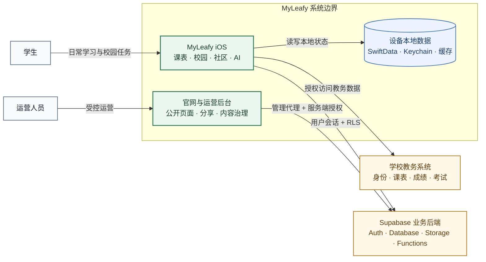
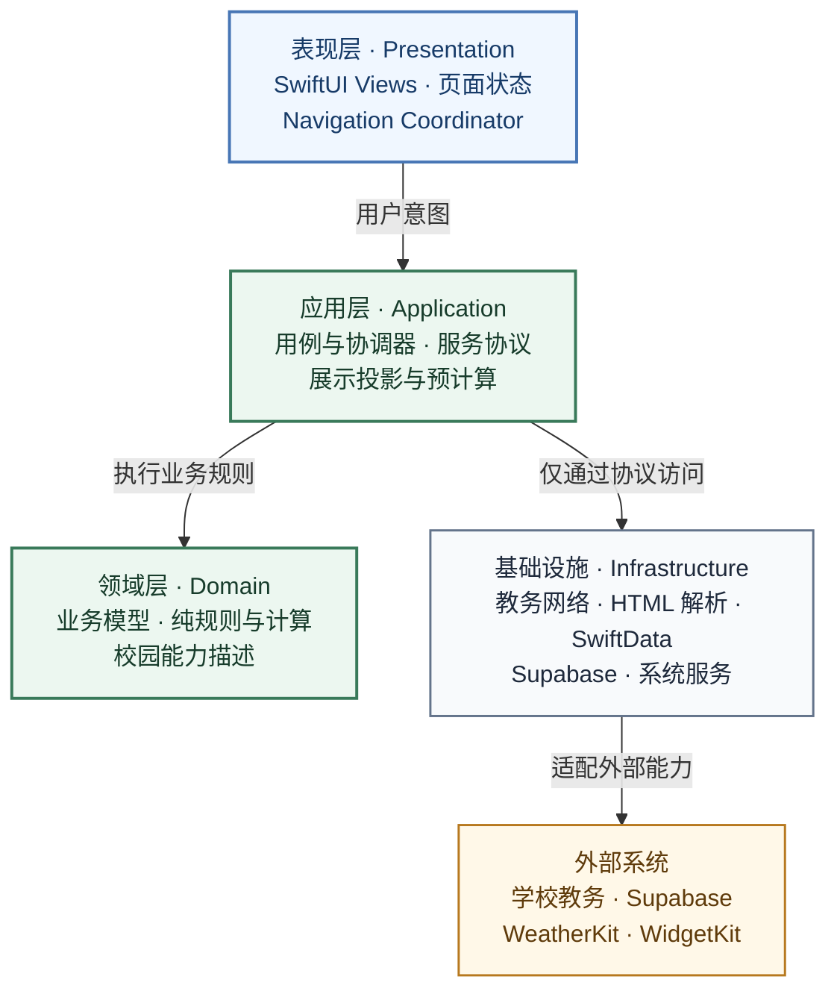
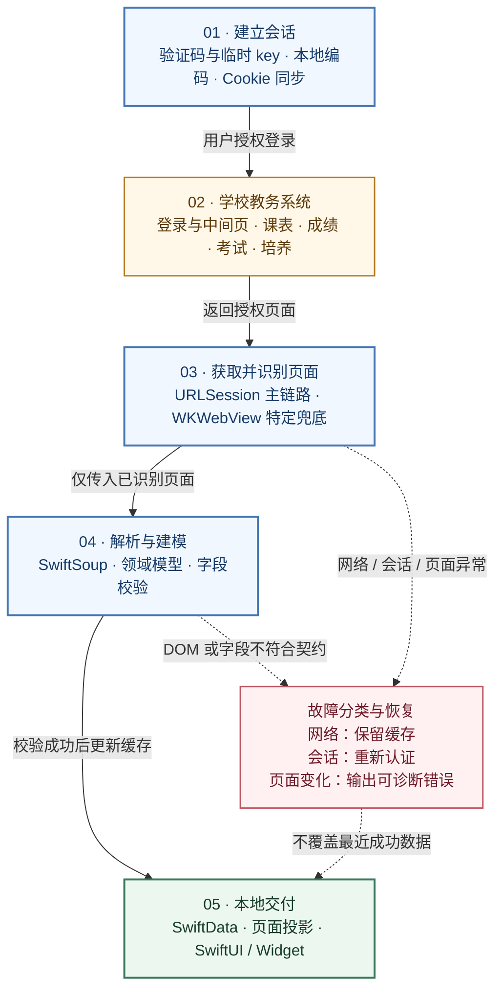
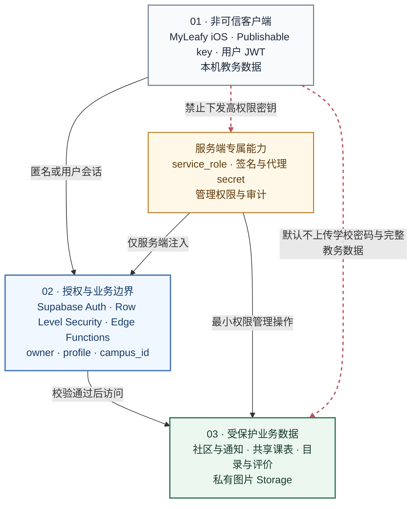
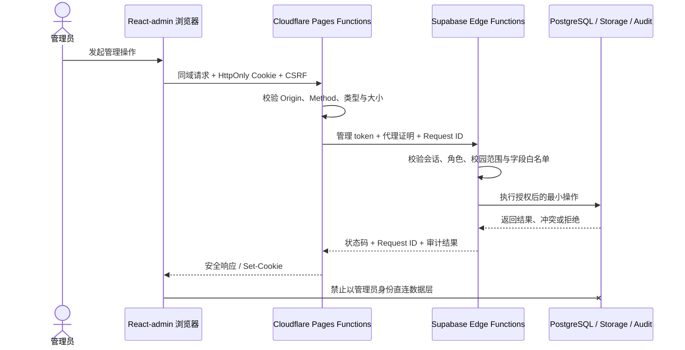

# 系统架构

MyLeafy 同时面对三类性质不同的系统：不稳定的学校网页、强调本地体验的 iOS 客户端，以及需要严格授权的云端社区和运营业务。架构目标是隔离变化、明确权威来源，并让远程故障不会无条件阻断本地体验。



## 运行单元

| 单元 | 部署位置 | 职责 |
|---|---|---|
| MyLeafy iOS App | 用户设备 | 学校登录、数据获取、本地持久化、UI 与普通业务请求 |
| 学校教务系统 | 学校基础设施 | 学校身份、课表、成绩、考试和培养数据 |
| Supabase | 托管云服务 | Auth、PostgreSQL、RLS、Storage、Realtime 与 Edge Functions |
| 官网与运营后台 | Cloudflare Pages | 公开页面、分享落地页、管理界面与管理 API 代理 |

## iOS 分层



```text
leafy/
├── App/          应用启动、根导航、主题与生命周期
├── Core/         依赖、持久化、校园能力与跨功能基础设施
├── Features/     Auth、Timetable、Community、Discover、Profile
├── Services/     教务、Supabase、同步与诊断服务
├── Parsers/      教务 HTML 解析
└── Shared/       跨功能模型与共享组件
```

依赖方向以业务边界为准：

- `Presentation` 负责 SwiftUI View、页面状态与导航适配。
- `Application` 负责用例、协调器、服务协议和数据组合。
- `Domain` 保存不依赖 UI 的模型、规则、投影和纯计算。
- `Services` 与 `Parsers` 隔离外部系统、Cookie、HTML 和网络细节。
- `App` 只做全局组装，不承载页面解析或复杂业务计算。

## 学校数据链路



典型过程为：用户授权登录 → 建立教务会话 → 访问目标页面 → 识别登录页或中间页 → 解析 HTML → 转换为领域模型 → 写入本地缓存 → 生成页面投影。

必须区分网络失败、会话失效、页面结构变化和数据为空。它们需要不同的恢复策略，不能统一显示为“加载失败”。

## Supabase 边界



- iOS 使用 publishable key 和用户会话。
- 数据授权依赖 RLS、资源所有权和校园范围。
- Storage 使用私有 bucket、受控路径和 signed URL。
- Edge Functions 承载跨表、外部服务或高风险业务操作。
- `service_role` 和管理代理 secret 不得进入 iOS 或浏览器 bundle。

## 运营后台边界



管理请求遵循“浏览器 UI → Cloudflare Pages Functions → Supabase Edge Functions → 数据库/Storage”。浏览器不持有管理 token 或服务端密钥；权限、校园范围、参数和审计均在服务端重新校验。

## 架构约束

1. 学校 HTML 与 Cookie 不进入通用页面层。
2. UI 隐藏不作为权限控制。
3. 页面不直接拼装任意数据库查询或管理 action。
4. 本地、学校和 Supabase 数据必须明确各自的权威来源。
5. 新校园差异应收敛到 capability、描述和适配器，而非散落条件判断。
6. 复杂课表使用预计算投影、缓存和窄状态更新控制渲染成本。

完整说明见仓库[架构文档](https://github.com/IsaacHuo/leafy/blob/main/docs/architecture.md)。


