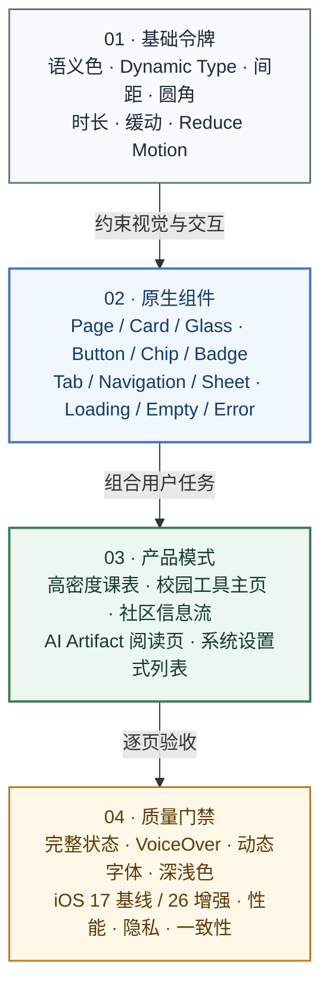

# 设计系统

MyLeafy 以原生 iOS 交互为基础。设计系统的任务不是覆盖系统组件，而是统一主题语义、页面层级和复杂校园信息的呈现方式。

## 核心原则

- 优先使用系统导航、Tab、List、Form、Sheet、Alert 和 SF Symbols。
- 使用语义令牌表达背景、文字、强调、边框和状态，不在业务页面散落硬编码颜色。
- 信息密度由层级、间距和排版控制，不依赖大量装饰卡片。
- 新系统视觉能力是增强项，必须保留 iOS 17–25 的稳定回退。
- 动效用于说明状态变化与空间关系，不延迟主要任务。
- 深色模式、动态字体、VoiceOver、Reduce Motion 和对比度属于完成标准。

## 页面层级

| 层级 | 典型用途 | 设计要求 |
|---|---|---|
| 根页面 | 课表、校园、社区、个人 | 保持稳定结构，不堆叠临时入口 |
| 领域主页 | 校园工具、学习空间等 | 按用户任务分组，明确数据来源和状态 |
| 详情页 | 课程、帖子、成绩、配置 | 信息层级清晰，主操作唯一且可预测 |
| Sheet / Dialog | 创建、筛选、确认 | 内容聚焦，危险操作明确影响与可逆性 |

## 状态设计

每个远程页面至少考虑：

- 首次加载
- 有缓存时刷新
- 空状态
- 网络不可用
- 会话失效
- 权限不足
- 部分数据成功
- 数据结构变化或解析失败

错误信息应帮助用户判断是否可以重试、重新登录、使用缓存或等待服务恢复。

## 组件使用

- **课表网格**：优先保证时间与课程位置准确；布局计算应从 View body 中移出。
- **信息卡片**：只在需要形成独立语义组时使用，避免所有内容卡片化。
- **表单**：字段说明与校验靠近输入；提交期间防止重复操作。
- **危险操作**：写清对象、影响与恢复方式，不使用含糊的“确定吗”。
- **Artifact**：主回答保持轻量，复杂报告、表格、图表和公式进入独立阅读页。

完整令牌、组件与评审清单见[UI 风格规范](https://github.com/IsaacHuo/leafy/blob/main/docs/ui-style-guide.md)和[UI 设计总结](https://github.com/IsaacHuo/leafy/blob/main/docs/Leafy_UI%E8%AE%BE%E8%AE%A1%E6%80%BB%E7%BB%93.md)。

